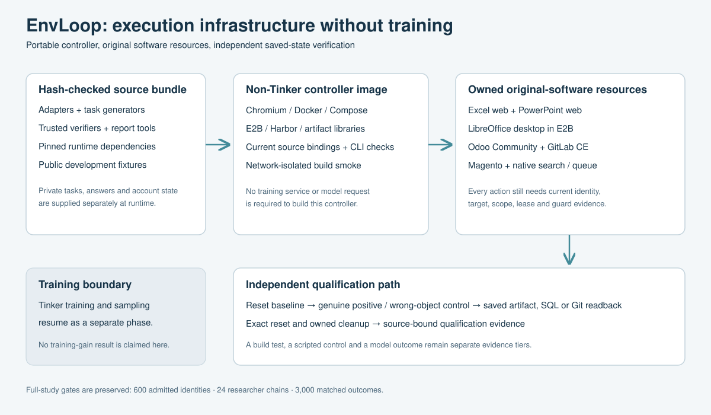

# Non-training build and verification

Updated: 3 October 2026. This build assumes Tinker is unavailable. It makes no model-performance claim and does not change the full study's 4-researcher by 6-cell design. The published 2 October PDF and container receipts retain their original, dated evidence.

## Executable components

The controller preserves the repository layout and hash-bound runtime dependencies. It includes Chromium, Docker and Compose clients, E2B desktop clients, Harbor 0.23 with its E2B extra, application adapters, task generators, independent verifiers and English report tooling. Tinker is not installed. A source archive and its complete file-hash manifest accompany the image.

| Cell | Current entrypoint | Independent verification | Actual execution boundary |
| --- | --- | --- | --- |
| Excel web | `tools.office_current_worker_cli_v6` | Original rich SEC graph and saved workbook checks | 140 original packages replayed offline; fresh bound native lifecycle pending |
| PowerPoint web | `tools.office_current_worker_cli_v6` | Saved deck text, chart and collateral checks | Current TRAIN baseline uploaded to genuine PowerPoint; two equivalent downloads, distinct cloud reset and empty-folder cleanup verified; bound Host6 controls pending |
| Native desktop | `native_desktop_factory.native_editor_runtime_v50` | Saved Calc, Impress and Writer artifacts | V48 Calc trio and V50 Writer 0/1/0 trio passed with distinct exact resets; current Impress and complete multi-application qualification pending |
| Odoo Community | `enterprise_fallback.odoo18.native_surface_workers_v14` with `tools.odoo_v066_native_reference_qualification_v9` | Trusted SQL state, exact reset and native receipt audit | Original selection20 controls passed 0/1/0 per case, exact reset and complete visual source review; canonical purchase, CRM calibration and original failed-case regression also passed; full final cohort and model outcomes pending |
| GitLab CE | `gitlab_world.v066_uniform_model_workers_v15` | Saved SQL plus Git trees, blobs and relationships | Three fresh neutral cycles and the current TRAIN GUI 1/0/1 trio passed; complete activity/link rendering and asset-register source review remain pending; earlier V14 controls receive zero current credit |
| Magento | `magento_catalog_factory.native_surface_workers_v10` | Catalog SQL, search state, queue ownership, principal witness and exact reset | One fresh TRAIN trio verified: baseline 0, positive 1, wrong variant 0; pixel robustness unestablished; zero formal results |

Current source bindings and CLI help are checked in isolated processes inside the image. These checks construct no application worker, create no cloud guest, train no model and dispatch no inference. An application run requires its original private task allocation, owned execution resource and reviewed authority. The image alone is not a replacement application sandbox.

Magento's fresh `native_reference_qualification_v7` controls passed saved SQL/search, queue, reset and cleanup audits. The repair accepts an owned rendered account header after scrolling; target and focus viewport checks remain strict. Its small raw-HTML source raster does not establish pixel robustness or model readability. Earlier controls receive zero new-epoch credit. Source and receipt hashes are in the [aggregate qualification note](../../docs/evidence/magento-rendered-principal-trio-2026-10-02.md).

Desktop v47 retains v46's verified screenshot policy for every role. It rounds proof expiry down by one floating-point step; the original strict ten-second validator, native flags and actor budgets remain unchanged. The fresh control passed the previous typing refusal and reached the actual Save command. Native window facts identified the subsequent Confirm File Format dialog; saved bytes remained the baseline. Full qualification and Enter coverage remain pending. Historical failures receive no new-source credit.

V48 declares a supported file-format preference in every fresh isolated guest before document open. It verifies the installed schema, absent profile, stopped application and original binary before writing the preference. The actual profile remains separately hashed; all other scoped profile properties must match the original baseline. Five genuine Calc actions then produced a saved positive, independently rederived by Root, with 63 non-target cells unchanged. A different guest restored the exact baseline and both guests were cleaned. This one positive/reset does not qualify the complete desktop cell.

The [V50 Writer control](../../docs/evidence/native50-writer-positive-reset-2026-10-03.json) observes bounded visible paragraphs from the owned writable document. It preserves raw native focus and sensitivity flags, the original keyboard guard and every inventory/action/time cap. Five actual GUI actions saved the correct finding; the original no-regression verifier was independently rederived and the saved source table and other findings were visually reviewed. A different guest restored the exact baseline and both guests terminated. This positive-only receipt does not cover baseline or wrong-variant controls.

The subsequent [current Writer trio](../../docs/evidence/native50-writer-trio-2026-10-03.json) passed 0/1/0: the untouched baseline fails, the saved correct finding passes, and the saved authored wrong value fails only the target-text check. Root independently rederived every verifier and all three byte-exact resets. Six distinct guests terminated. This completes the current public Writer control trio, while Impress and the formal cohort remain pending.

The Office native picker checks exact selected-file URI equality, baseline hashes, file ownership and private evidence. It uses the normal macOS dialog and changes no extension permissions. The actual current selector source was exercised in the disposable TRAIN folder. Host6 binds this one transport to all roles and fresh resets; the manual lifecycle diagnostic alone cannot qualify it. Its repaired full-inventory operation passed; native document creation subsequently stopped because macOS was locked. The pending dialog and lease are retained until explicit cleanup. See the [dated Office evidence](../../docs/evidence/office-native-picker-current-baseline-2026-10-03.md).

Odoo Reference6 uses the original software's visible manual-save control. An already-saved form is accepted only through a positively observed stable native saved indicator, followed by the same reload and independent SQL readback. The original Native14 actor source is unchanged. The [terminal original-allocation receipt](../../docs/evidence/odoo-ref6-original100-terminal-2026-10-03.json) preserves 50 completed controls, 1,770 guarded actions and 3,540 source-bound screenshots, plus the first sales failure and exact reset. It is not a 100-case completion or formal model result.

The later [Reference7 terminal audit](../../docs/evidence/odoo-ref7-original100-terminal-2026-10-03.json) independently rederived all 77 completed original controls: 25 purchase, 25 inventory, 25 sales and two CRM. It retains 2,887 guarded actions and 5,774 screenshots. The 78th case stopped before a negative Save dispatch because the installed priority widget had automatically saved. Exact reset and service restoration passed. Reference8 waits for a positively observed stable native saved indicator after every original CRM priority click, then uses the unchanged Reference7 save, reload and SQL verifier. No old controls are promoted into this source epoch.

The [GitLab V7 neutral audit](../../docs/evidence/gitlab-neutral-v7-non-training-2026-10-03.json) verifies three actual startup helper calls with the effective 60-second setting, 970 retained raw files, all 33 Git project trees per cycle, exact original SQL/Git restoration, and removal of every owned clone, mount and subtree. All seven task roles bind the same 146-file source closure. This is environment verification; no task identity or model result was consumed.

The subsequent [GitLab V15 TRAIN controls](../../docs/evidence/gitlab-v15-native-train-2026-10-03.json) completed 1/0/1 under that source, with 15 actual native dispatch receipts, 30 reopened screenshots and exact SQL/full Git resets. Root viewed all three final issue/label frames. The native action/reset prerequisite is accepted; complete linked-items/activity rendering and CISA asset-register source readability remain unqualified.

The [Reference8 CRM calibration](../../docs/evidence/odoo-crm-autosave-calibration-2026-10-03.json) completed 0/1/0 with 18 guarded actions, 36 screenshots, an actual zero-input priority-autosave wait, independent saved-state scoring, exact reset and visual source review. Qualification9 preserves Native14's canonical purchase TRAIN gate and requires this separately identified CRM calibration plus the original failed-case regression before a full split. The earlier incompatible CRM-as-canonical-TRAIN attempt is retained as a pre-world orchestration failure.

The [original selection20 control qualification](../../docs/evidence/odoo-q9-selection20-controls-2026-10-03.json) completed all four five-case families under the current source. All 20 saved 0/1/0 verdicts, exact resets, protected-state checks and service restoration were independently rederived. Root viewed every native source and exact PDF/TXT original after the terminal source manifest was generated. The run retains 529 guarded actions and 1,058 screenshots. This is a model-free selection control qualification, not 20 model evaluations, a final100 admission or a training result.

## Preserve the difficult data

The rich Excel replay retains the original workbook bytes, source assets and trusted graph code. Its 140 packages span 33 issuer families, 140 filings and 16 graph types, including 13 final graph types. The saved replay checks 1,997 numeric facts and 9,985 formula targets. All 140 reference positives pass, all 140 unrepaired seeds fail, and all 1,260 individually isolated faults fail. Source and scenario counterfactuals are retained. These are artifact-verifier checks, not Excel-web agent outcomes.

PowerPoint uses the original current WDI plan with 20 training, 20 selection and 100 final candidates. Portable generation replaces a proprietary generation dependency without reusing old application-native qualification. Baseline, positive, near-miss, collateral-change and wrong-chart artifact controls are checked separately.

The earlier two-issuer Excel engineering pool is explicitly development-only and excluded from the current 280-package Office index. Private instructions, gold answers, task allocations, account state and credentials are not included in the public image or source archive.

## What can run without Tinker

- Build the source archive and runner image; verify their complete hash manifests.
- Run offline generator, parser, verifier and browser checks, including Harbor CLI and agent imports.
- Prepare current application bindings and task metadata; inspect original-software state.
- Execute reviewed, owned reference controls and check saved state and reset.
- Generate methods and evidence reports from completed checks.

Training, checkpoint selection and a trained-versus-base matched comparison remain blocked by the unavailable training provider. The full study still requires 600 independently admitted final identities, 24 completed researcher chains and 3,000 reconciled matched model outcomes. This build contributes zero official final identities, chains or outcomes.

## External requirements

Original Office web needs the existing signed-in browser and permission to upload owned files. The observed Chrome bridge refused local-file upload because "Allow access to file URLs" was disabled. A native file-picker fallback also requires the Mac to be unlocked; its last actual preflight stopped at the lock screen before any upload. No second Office account is required for this lightweight owned-folder path.

Supply Linux resources, E2B credentials and Docker daemon access at runtime. The first CI build, isolated smoke and GHCR push passed. Organization policy disables public package visibility, so anonymous image pull is unverified. An administrator must enable it. The [public source/PDF release](https://github.com/EnvLoop/cua-rsibench/releases/tag/v0.6.2-non-training-build) was independently downloaded without authentication. Refreshes require their own source and image receipts; the earlier release is preserved.

## Reproduce the build

See [README.md](README.md) for staging, build and network-isolated verification commands. Keep the original output and supervision receipts when an actual control fails. An infrastructure failure receives no invented score and is not silently replayed. Additive runtime repairs require fresh source witnesses; older native controls are not automatically promoted into a changed epoch.

## Validation record

The latest completed controller regression profile passed 3,362 tests with 64 conditional skips and no failures. Seven Desktop SDK tests passed separately in a compatible E2B Desktop 2.2 / Pillow 11.3 interpreter. Subsequent focused checks cover the additive interruption-safe GitLab reset, preserved Writer pointer states, and CRM automatic-save observation. Tests and source checks contribute no model outcome or native task admission.

## Closure checklist

- Built and checked: portable runner, rich-data generators, independent verifiers, reset paths, artifact readback, browser actions, source bindings and English reporting.
- Native qualification still pending: Office upload/save/download/reset and Desktop commit/save/readback/reset. Portable checks provide no substitute credit.
- External blockers: Office's locked local picker or disabled upload bridge, organization-controlled GHCR visibility, and unavailable training. No full-study result is claimed.
