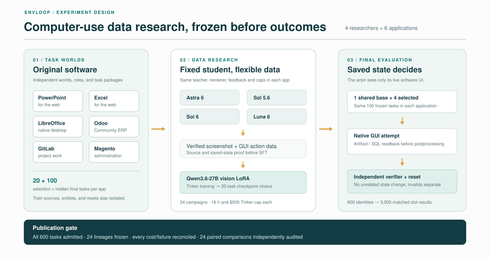

# Full computer-use study: pre-result protocol

**Status:** methodological specification, not a completed study or a result. Freeze its exact revision before the first official final-task outcome. Any change to cells, task identities, evaluator, budgets, or analysis after that point must be an explicit amendment that preserves the prior revision and outcomes.

*Figure 1. The planned data-only research loop and independent final evaluation. Counts describe the preregistered design, not completed results.*

## Relation to RSIBench-Data

This is an **adaptation, not a replication**, of [RSIBench-Data](https://arxiv.org/pdf/2607.25886). Both designs have four researcher configurations across six benchmark settings, but the task pools, student, teacher, researcher systems, applications, and primary estimand differ. RSIBench-Data used benchmark-native final sizes of 100, 100, 100, 89, 100, and 30, with four decodes per AIME problem; this study proposes 100 final computer-use identities per application. RSIBench-Data's primary result is the selected checkpoint's native benchmark score, whereas this study preregisters a paired base-to-selected gain. RSIBench-Data also acknowledges selecting checkpoints and rerunning official evaluations on the same task subset; this study deliberately separates 20 selection tasks from 100 final tasks. The two studies' scores cannot be compared directly. Their common lesson is to control the researcher's data-only lever while holding training and evaluation infrastructure fixed within a setting.

## Question and comparison

Can a researcher agent improve a fixed vision-capable computer-use student by constructing and selecting task-disjoint training data under a common budget? The student is `Qwen/Qwen3.8-27B`; the rollout teacher is `gpt-5.6-sol`. The four researcher configurations are `gpt-6-astra`, `gpt-5.6-sol`, `gpt-6-sol`, and `gpt-6-luna`. They receive the same initial training sources, task instructions, observation/action grammar, 20-task selection feedback, teacher, student, software version, and budget **within each application cell**. Each researcher owns a fresh training/checkpoint lineage. The six provisionally selected cells are PowerPoint for the web, Excel for the web, native desktop software, Odoo Community, GitLab, and Magento administration. [The dated enterprise amendment](FULL_STUDY_ENTERPRISE_AMENDMENT_2026-09-25.md) records the ServiceNow-to-Odoo substitution before any official final outcome; Odoo inherits no WorkArena task identity, provenance, or result. Before campaign dispatch, bind each provider-reported model identity and available snapshot, researcher reasoning effort, full system prompt, tool grammar, teacher rollout parameters, Qwen renderer/preprocessor, SFT configuration, and software/runtime hashes. Researcher systems can differ in more than model weights; conclusions concern these frozen configurations, not a pure model-effect ranking.

[The dated desktop source amendment](FULL_STUDY_DESKTOP_SOURCE_AMENDMENT_2026-09-25.md) selects original WDI-derived LibreOffice tasks as the provisional `desktop-native` source before any official outcome. OSWorld remains a quarantined development comparator and contributes no task identity, rights clearance, evaluator, or score to this cell. The current v2 WDI task inventory is 20 train/20 selection/100 final candidates with **zero** official final admissions. Its split templates have distinct physical structures, but 96 final candidates lack complete GUI controls and 24 final Impress files remain unnormalized; full runtime/image/profile and Qwen action/sampling contracts still block a freeze.

[The dated Magento source amendment](FULL_STUDY_MAGENTO_SOURCE_AMENDMENT_2026-09-25.md) replaces the public WebArena-Verified Magento final queue with original supplier-quote/catalog reconciliation candidates on the pinned Magento sample catalog. The 20/20/100 task design separates configurable parent families across splits and uses four different five-variant final policies. Its source facts are a mix of real application sample data and explicitly synthetic supplier operations; no original candidate has yet passed task-specific GUI positive/negative/reset controls or joined an official final denominator. Published WebArena task 777 is a train-only technical demonstration and remains quarantined from held-out evaluation.

For Excel for the web, [the filing-pinned SEC integrated candidate audit](evidence/sec-integrated-offline-140-2026-09-25.md) adds 20/20/100 authored workbook pairs and an independent offline OOXML oracle. Those 100 final candidates currently share only seven filing pairs from two issuers and one structural workflow, so they are an engineering pool, not a discriminating hidden final set. Source-family/template expansion and per-document Excel-web save, download, and fresh-copy reset remain required before the Excel cell can freeze.

The primary endpoint for each cell and researcher is the paired percentage-point difference between its selected checkpoint and **one shared base-model execution** on the same 100 frozen task identities. Both numerator and valid denominator are published. A task scores 1 only when the application-native target is saved and an independent verifier accepts the intended change with no disallowed side effects; otherwise a valid model outcome scores 0. Provider, transport, environment, and verifier failures are not model failures and remain separately counted. A partial state may be reported diagnostically but does not change the binary primary endpoint unless the task rubric was frozen with graded credit.

## Admission and isolation

Each of the six cells needs 20 selection tasks and 100 individually admitted official final tasks. A source count, offline split, one-task GUI control, generated task variation, or upstream network-only score cannot substitute for admission. Before freezing a final identity, an evaluator-owned process must show: native GUI known-positive and plausible negative attempts; persisted artifact/database readback; unrelated-state checks; fresh-attempt reset; fixed task/evaluator/runtime hashes; legal source use; and the fixed Qwen observation/action interface. A score-only VLM/LLM judge needs calibration cases and a frozen judge version. The actor cannot write its own evaluator, gold files, or acceptance receipts.

Train, selection, and final identities are disjoint. Source-document, template, entity, and seeded-world overlap are checked and reported separately; a family with uncertain entity overlap is not called independent. Previously published upstream task text or gold is labeled public exposure even when the selected final ID list is withheld. A sealed transfer cohort requires evaluator-controlled, unexposed task variants or independently authored sources. Training demonstrations that use a provisional final task remove that task and its contaminating family from final consideration **before** checkpoint training.

## Campaign and final execution

There are 24 researcher campaigns, four per cell. Nominal campaign limits are 16 wall-clock hours and $500 Tinker usage, yielding a $12,000 aggregate *Tinker ceiling*, not a bill estimate. Other inference, E2B, storage, application, and license costs are tracked separately under an all-in controller. A paid dispatch reserves its worst allowed token envelope before sending; actual billed usage, discounts, credits, and provider errors are separate fields. A failed or uncertain provider response is reconciled before any retry.

Budget parity is broader than Tinker. Before the first campaign, freeze **the same per-campaign limits** for researcher inference dollars and calls, teacher rollout dollars/tokens/calls, E2B dollars/sandbox-hours/peak concurrency, storage/application dollars, maximum candidates/selection evaluations, and all-in dollars. Record provider rate limits, actual throughput, and disconnections separately. A researcher that stops at a provider quota is not silently given extra time or calls. Unknown balances or unbounded external services prevent a claim of matched budgets.

One base checkpoint is executed once on each cell's 100 final tasks and shared across the four within-cell comparisons. Each of the four selected *slots* receives a result on those same 100 tasks. Thus the declared initial final phase has 600 distinct task identities and **3,000 slot-task results**. If a researcher selects a checkpoint byte-identical to the shared base or another selected checkpoint in that cell, its slot reuses the exact frozen execution; the matrix records which slot owns that evidence and the lower count of unique checkpoint-task executions. The selected checkpoint is frozen from selection feedback before official evaluation. Final results never feed new training or checkpoint choice. A rerun can repair only a predeclared infrastructure-invalid attempt; it retains the original attempt, reason, run identity, and cost, and is not an extra independent sample. If an identity has no valid scored outcome after the controlled recovery window, the cell is incomplete rather than silently scoring it zero.

## Analysis and reporting

Report each cell and researcher separately: base and selected wins out of 100; paired gains/losses on task IDs; number and causes of invalid attempts and recoveries; source/template/entity cluster sizes; actions, wall time, provider latency, tokens, Tinker billed usage when available, and non-Tinker cost. Show first-to-best researcher candidate changes, checkpoint selection, and whether earlier capabilities regressed. The **primary uncertainty presentation** is paired source-family analysis: report every family's number of tasks and base-to-selected wins/losses, and use a cluster-level paired bootstrap interval only when enough independent families exist. A task-level paired bootstrap is secondary and labeled as treating within-family variants as independent. If a cell has fewer than ten credible source families, provide its exact family outcomes and treat intervals as descriptive rather than strong generalization evidence. Report all 24 cell/researcher comparisons; if formal significance tests are made, apply Holm's step-down adjustment across those 24 tests. Single-seed/single-rollout results cannot establish across-seed stability. Any across-cell macro-average is secondary, equal-weights the six cells, and is calculated only after all six pass the full admission/result audit; no post hoc substitution or task-weighted pooling.

One primary source-family assignment per task is hash-bound in the matrix manifest **before** outcomes; it must be one of the task's declared source groups and cannot be regrouped after seeing scores. The reference [paired analysis implementation](../src/cursibench/full_study_stats_v1.py) refuses incomplete or nonbinary task outcomes, reports all family-level deltas, uses a fixed-seed 10,000-replicate family-cluster interval plus a secondary task bootstrap, and provides the Holm adjustment calculation. Those intervals are conditional on the frozen checkpoint and one rollout seed, not training-run uncertainty. No real final outcome has entered this implementation yet.

Before freezing the original WDI-derived LibreOffice `desktop-native` cell, publish its actual application/image/font/profile versions and task-type quotas. The current 100 candidates comprise 50 Calc, 25 Impress, and 25 Writer files, with **zero individually admitted final tasks**. The earlier v1 shared-template design was rejected; v2 implements distinct split structures, while 96 missing final GUI trios and 24 unnormalized final Impress files remain explicit blockers. A generic desktop label or candidate count is insufficient to support a reproducible 100-task denominator; if final tasks change, amend the quotas before outcomes.

Publish all attempted candidate counts, rejected datasets, trained checkpoint lineages, final outcomes, timeouts, and provider/environment/verifier failures. Preserve false-positive calibration examples such as the Office partial-title rubric and the Magento network-save gap. The English PDF, figures, and explorer are generated from audited machine-readable evidence, visually reviewed, scanned for private account/HAR/gold leakage, and downloaded from the public release for hash verification. A paper may describe partial implementation as methods work, but may not headline this full matrix until 24 campaigns and all six 100-task cells are complete.

The [complete-result audit](FULL_STUDY_RESULTS_AUDIT.md) specifies the hash-bound 24-campaign execution index and fails closed on missing task results, unclassified infrastructure attempts, evaluation before selection freeze, cost-cap excess, or checkpoint/task drift. Its synthetic tests do not count as executed campaigns.

## Current boundary

The [pre-campaign freeze](FULL_STUDY_PRE_CAMPAIGN.md) enforces six qualified base cells and 24 identical-budget researcher intents before training. The [post-campaign matrix gate](FULL_STUDY_MATRIX.md) then binds the 30 matched base/selected slot manifests back to that exact freeze. The [Office](evidence/office-web-100-provisional-screen-2026-09-25.md), [original SEC Excel](evidence/sec-integrated-offline-140-2026-09-25.md), [original Magento](evidence/magento-original-catalog-100-candidates-2026-09-25.md), and [original native desktop](evidence/native-wdi-original-desktop-development-2026-09-25.md) inventories remain provisional. The earlier public WebArena/SaaS and [OSWorld](evidence/osworld-native-office-admission-2026-09-25.md) audits remain separate development comparators. [Odoo Community](evidence/odoo-community-four-family-gate-2026-09-25.md) has four original-software development workflows but zero officially admitted final tasks. [WorkArena ServiceNow](evidence/servicenow-workarena-pdi-gate-2026-09-25.md) remains a separately gated supplemental evaluation track; access is pending and its instances cannot be used for training. Existing Qwen/Magento runs are public development diagnostics. At this revision, **zero** official final task identities and **zero** full-matrix campaigns have been admitted or executed.
