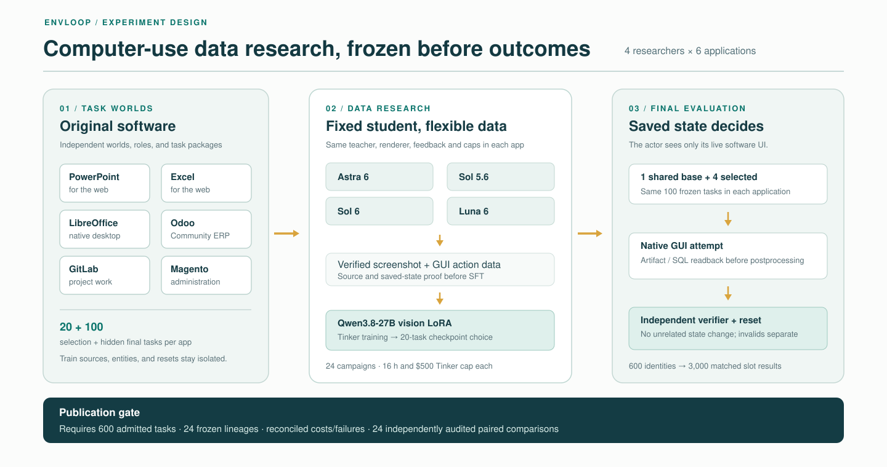

# Full computer-use study: pre-result protocol

**Status:** methodological specification, not a completed study or a result. Freeze its exact revision before the first official final-task outcome. Any change to cells, task identities, evaluator, budgets, or analysis after that point must be an explicit amendment that preserves the prior revision and outcomes.

## Current evidence boundary (2026-09-28)

The six cells each have 20 training, 20 selection, and 100 **offline candidate** identities. This is a construction milestone, not 600 admitted final tasks. PowerPoint's active v13 inventory has 140 source-checked decks and no active-pool per-ID web GUI trio; its separate 80-case training-calibration set is not a held-out result. The [private SEC Excel split audit](evidence/sec-private-full-offline-140-2026-09-27.md) verifies 140 distinct filing accessions, 33 issuer families, and 13 final workflow types offline, but no per-ID Excel-web save/download/reset trio. The native desktop cell has 100 historical evaluator GUI trios and now [one independently accepted prospective v0.6.6 guest-attested trio](evidence/native-wdi-v066-first-control-audit-2026-09-28.md); the other 99 current-profile controls remain. Odoo has 100 historical native GUI candidate controls and a train-only v0.6.6 smoke, not 100 current-contract admissions. [GitLab's independent requalification audit](evidence/gitlab-requalification-100-2026-09-28.md) verifies 100 current evaluator GUI trios and retains all six first-attempt failures, but does not convert them into model scores or official admissions. Magento's [cell-wide cron-free runtime](evidence/magento-cron-cellwide-runtime-freeze-2026-09-28.md) and [bounded resumable 100-case protocol](evidence/magento-resumable-100-freeze-2026-09-28.md) were frozen before its revised candidate sweep; the historical 35 controls are excluded from that sweep.

The executable [researcher campaign gate](FULL_STUDY_CAMPAIGN_DISPATCH.md), [selection environment accounting](evidence/full-study-selection-environment-classes-2026-09-28.json), [final-task dispatch gate](FULL_STUDY_FINAL_DISPATCH.md), and [result-paper audit](FULL_STUDY_RESULTS_AUDIT.md) reject incomplete input. A [pre-result sequencing amendment](FULL_STUDY_V066_CONTROL_CODE_FREEZE_AMENDMENT_2026-09-28.md) and [source-only v0.6.6 digest](evidence/full-study-v066-code-only-control-ratification-2026-09-28.md) freeze common adapter bytes for evaluator-only controls; they do not grant live application acceptance or campaign authority. A [read-only Tinker preflight](evidence/full-study-tinker-v066-read-only-preflight-2026-09-28.md) and [paid one-step toy vision smoke](evidence/tinker-qwen38-vision-one-step-smoke-2026-09-28.md) confirm Qwen train/sample API compatibility without starting a researcher campaign. A separate [organization usage snapshot](evidence/full-study-tinker-billing-baseline-2026-09-28.md) returns counts and hashes but neither an invoice nor available balance. None of these checks creates a benchmark model result. At this evidence checkpoint, **official final admissions are 0/600, completed researcher campaigns are 0/24, matched final slot-task outcomes are 0/3,000, and there is no full-study result PDF**. The dated sections below retain the sequence of earlier source and runtime amendments; their historical candidate counts must not be read as the current active-pool status.



*Figure 1. The planned data-only research loop and independent final evaluation. Counts describe the preregistered design, not completed results.*

## Relation to RSIBench-Data

This is an **adaptation, not a replication**, of [RSIBench-Data](https://arxiv.org/pdf/2607.25886). Both designs have four researcher configurations across six benchmark settings, but the task pools, student, teacher, researcher systems, applications, and primary estimand differ. RSIBench-Data used benchmark-native final sizes of 100, 100, 100, 89, 100, and 30, with four decodes per AIME problem; this study proposes 100 final computer-use identities per application. RSIBench-Data's primary result is the selected checkpoint's native benchmark score, whereas this study preregisters a paired base-to-selected gain. RSIBench-Data also acknowledges selecting checkpoints and rerunning official evaluations on the same task subset; this study deliberately separates 20 selection tasks from 100 final tasks. The two studies' scores cannot be compared directly. Their common lesson is to control the researcher's data-only lever while holding training and evaluation infrastructure fixed within a setting.

## Question and comparison

Can a researcher agent improve a fixed vision-capable computer-use student by constructing and selecting task-disjoint training data under a common budget? The student is `Qwen/Qwen3.8-27B`; the rollout teacher is `gpt-5.6-sol`. The four researcher configurations are `gpt-6-astra`, `gpt-5.6-sol`, `gpt-6-sol`, and `gpt-6-luna`. They receive the same initial training sources, task instructions, observation/action grammar, 20-task selection feedback, teacher, student, software version, and budget **within each application cell**. Each researcher owns a fresh training/checkpoint lineage. The six provisionally selected cells are PowerPoint for the web, Excel for the web, native desktop software, Odoo Community, GitLab, and Magento administration. [The dated enterprise amendment](FULL_STUDY_ENTERPRISE_AMENDMENT_2026-09-25.md) records the ServiceNow-to-Odoo substitution before any official final outcome; Odoo inherits no WorkArena task identity, provenance, or result. Before campaign dispatch, bind each provider-reported model identity and available snapshot, researcher reasoning effort, full system prompt, tool grammar, teacher rollout parameters, Qwen renderer/preprocessor, SFT configuration, and software/runtime hashes. Researcher systems can differ in more than model weights; conclusions concern these frozen configurations, not a pure model-effect ranking.

[The dated desktop source amendment](FULL_STUDY_DESKTOP_SOURCE_AMENDMENT_2026-09-25.md) selects original WDI-derived LibreOffice tasks as the provisional `desktop-native` source before any official outcome. OSWorld remains a quarantined development comparator and contributes no task identity, rights clearance, evaluator, or score to this cell. The v2 WDI inventory is 20 train/20 selection/100 final candidates with **zero official full-study admissions**. As of 2026-09-27, all 100 evaluator-owned GUI positive/near-miss/fresh-reset trios and all 25 final Impress normalizations pass; the [saved-artifact semantic audit](evidence/native-wdi-semantic-saved-audit-2026-09-27.md) and [fair scorer candidate](evidence/native-wdi-fair-scorer-freeze-2026-09-27.md) add pre-result evidence. Full runtime/font/profile, rights/budget, and shared Qwen v0.6.4 action/observation/sampling contracts still block the six-cell freeze.

[The dated GitLab source amendment](FULL_STUDY_GITLAB_SOURCE_AMENDMENT_2026-09-25.md) selects original GitLab CE 18.5 tasks anchored to pinned CISA KEV advisory facts as the provisional `gitlab` source before any official outcome. The published WebArena-Verified GitLab queue remains a development comparator and transfers no task identity, evaluator, score, or difficulty label. The original-world 20 train/20 selection/100 final inventory is unsealed; its per-ID GUI and scoped-operator admission gates remain open, and official GitLab final admissions are **zero**.

[The dated Magento source amendment](FULL_STUDY_MAGENTO_SOURCE_AMENDMENT_2026-09-25.md) replaces the public WebArena-Verified Magento final queue with original supplier-quote/catalog reconciliation candidates on the pinned Magento sample catalog. The 20/20/100 task design separates configurable parent families across splits and uses four different five-variant final policies. Its source facts are a mix of real application sample data and explicitly synthetic supplier operations; [25 original final candidates](evidence/magento-original-gui-progress-25-2026-09-27.md) have passed evaluator GUI positive/wrong-variant/material-reset controls, including one explicitly bounded system-owned stock timestamp exception; none has joined the official final denominator. Published WebArena task 777 is a train-only technical demonstration and remains quarantined from held-out evaluation.

The next serial Magento candidate encountered a [native CMS menu interruption](evidence/magento-original-negative-neutral-interruption-2026-09-27.md) after its saved positive passed and before its separate negative clone could be edited. Material baseline state and exact disposable container cleanup were verified; the original failure is retained. The [pre-result one-case recovery rule](FULL_STUDY_MAGENTO_BOUNDED_GUI_RETRY_2026-09-27.md) permits at most one complete fresh-clone retry with the same candidate/controller/verifier, and no retry had been dispatched when the rule was recorded. This is infrastructure evidence, not model failure or official admission.

That [single recovery](evidence/magento-original-negative-neutral-retry-2026-09-27.md) passed a new full positive/wrong-variant/reset trio and exact pair cleanup, while the original timeout remained in the failure record. The [30-case Magento checkpoint](evidence/magento-original-gui-progress-30-2026-09-27.md) counts distinct development GUI controls only; official final admissions and hidden model calls remain zero.

For Excel for the web, [the filing-pinned SEC integrated candidate audit](evidence/sec-integrated-offline-140-2026-09-25.md) adds 20/20/100 authored workbook pairs and an independent offline OOXML oracle. Those 100 final candidates share only seven filing pairs from two issuers and one structural workflow, so they remain an engineering pool. Ten additional semantic workflows and 28 issuer identities have since been exposed as public development evidence. The [private split readiness screen](evidence/sec-private-split-readiness-2026-09-25.md) therefore requires 28 *new*, independently verified issuer families and ten *new* final workflow families before a hidden 20/20/100 allocation can pass. The current private registry is 0/0/0. Per-document Excel-web save, download, and fresh-copy reset remain required before the Excel cell can freeze.

For PowerPoint for the web, the [original WDI brief plan](plans/2026-09-25-original-wdi-ppt-web.md) has produced [20/20/100 offline candidate decks](evidence/ppt-wdi-original-offline-inventory-2026-09-25.md) across 25 final country source families and ten final causal workflows. All 140 have direct-OOXML and layout controls. One exposed training-source [PowerPoint-web native-chart control](evidence/ppt-wdi-powerpoint-web-train-triad-2026-09-27.md) has a downloaded positive, near miss, and fresh-copy reset after a separately frozen Office-saved baseline. One provisional final-candidate [four-edit development control](evidence/ppt-wdi-powerpoint-web-four-edit-development-2026-09-27.md) passed downloaded positive/near-miss/fresh-reset checks, but its four-task source family was quarantined after verifier/controller calibration. A separate [train-source feasibility check](evidence/ppt-wdi-powerpoint-web-chart-feasibility-2026-09-27.md) did not expose a data-editing control for an imported native chart in this account, so the ten planned chart-legend edits were replaced before results by four-target chart-caption reconciliation. The original final pool has 96 nonquarantined candidates; the [dated PPT source amendment](FULL_STUDY_PPT_SOURCE_AMENDMENT_2026-09-27.md) and [revised reserve audit](evidence/ppt-wdi-reserve-revision-2026-09-27.md) restore 100 offline candidates using a new source family. No replacement or other final candidate has yet passed the complete PowerPoint-web admission gate. The public PPT-Eval queue remains a development source screen, not a sealed final denominator.

A later evaluator-only GUI controller timing failure exposed a second four-task PowerPoint source family before any model or official result. The [second PPT source amendment](FULL_STUDY_PPT_SECOND_SOURCE_AMENDMENT_2026-09-27.md) quarantines it, and the [two-reserve audit](evidence/ppt-wdi-two-reserve-revision-2026-09-27.md) restored the 20/20/100 offline pool at that revision with a distinct original World Bank country CSV ZIP. The source and all 140 decks have independently checked source values, native charts, layout and offline controls. These checks do not substitute for 100 individual PowerPoint-web GUI admissions; that denominator remains unfilled.

A subsequent evaluator-only save of a negative-inflation deck exposed a material native-chart rewrite despite four correct text targets. The [third PPT source and chart amendment](FULL_STUDY_PPT_THIRD_SOURCE_AND_CHART_AMENDMENT_2026-09-27.md) quarantines its entire four-task family before model outcomes. The [three-reserve audit](evidence/ppt-wdi-three-reserve-revision-2026-09-27.md) restored a 20/20/100 **offline** inventory at that revision; all 140 direct-file controls passed. A two-stage Office-web baseline stabilization succeeded on the quarantined development copy, but negative-chart tasks require their own application-native baseline, saved positive, partial/collateral negative, and reset checks. No PowerPoint-web final identity was admitted.

A further evaluator-only positive-valued chart also changed after a single Office-web normalization. The [fourth PPT source and saved-state amendment](FULL_STUDY_PPT_FOURTH_SOURCE_AND_SAVED_STATE_AMENDMENT_2026-09-27.md) quarantines that source family and requires application-native baseline stabilization for **every** PowerPoint final candidate, followed by independent saved-file positive, partial/collateral negative and reset checks. The [historical four-reserve audit](evidence/ppt-wdi-four-reserve-revision-2026-09-27.md) restored 20/20/100 **offline** candidates with 136 prior specifications/deck semantics unchanged and 140 direct-file controls passing at that revision. The scorer accepts only observed target text formatting and edit-history equivalences; chart style/data and all non-target content remain strict after the baseline freeze. PowerPoint-web final admissions remained **zero**.

A fifth evaluator-only source family failed a published bounded one-retry qualification rule because a new Office editor thumbnail remained inaccessible despite saved files being retained. The [fifth source amendment](FULL_STUDY_PPT_FIFTH_SOURCE_AMENDMENT_2026-09-27.md) excludes that family and the [saved-artifact admission amendment](FULL_STUDY_PPT_SAVED_ARTIFACT_ADMISSION_AMENDMENT_2026-09-27.md) replaces the fragile third-editor check with two independent OneDrive downloads and OOXML readback. A [five-role training control](evidence/ppt-wdi-web-v4-train-controls-2026-09-27.md) passes positive/near-miss/fresh-reset/collateral discrimination, while the [historical five-reserve audit](evidence/ppt-wdi-five-reserve-revision-2026-09-27.md) restored 20/20/100 **offline** candidates at that revision. The prior failed candidate is not regraded. PowerPoint-web final admissions, hidden model calls and researcher campaigns remain zero.

A sixth evaluator-only family failed the saved-artifact no-regression gate: all four target edits persisted, but Office also rewrote the native chart. Its candidate was not retried or regraded. The [sixth source and persisted-positive amendment](FULL_STUDY_PPT_SIXTH_SOURCE_AND_PERSISTED_POSITIVE_AMENDMENT_2026-09-27.md) quarantines the four-task family and requires a durable intermediate positive save before restoring a neutral application-native baseline. The [V5 training audit](evidence/ppt-wdi-web-v5-train-persisted-positive-2026-09-27.md) verified two normalization cycles plus fresh-copy positive, near-miss, reset and collateral controls. The [current six-reserve audit](evidence/ppt-wdi-six-reserve-revision-2026-09-27.md) restores 20/20/100 **offline** candidates. The fifth audit is historical; PowerPoint-web final admissions, hidden model calls and researcher campaigns remain zero.

The [first v12 per-ID PowerPoint-web GUI checkpoint](evidence/ppt-wdi-v5-original-web-gui-progress-1-2026-09-27.md) passed the same saved-state controls on one private final candidate at that revision. It remained a development control pending the common source-rights/runtime/Qwen/budget freeze, so **official PowerPoint final admissions remained zero**; 99 individual GUI controls were still outstanding then.

A later v12 candidate's manually transcribed collateral selector failed before any edit. The [seventh source and collateral-binding amendment](FULL_STUDY_PPT_SEVENTH_SOURCE_AND_COLLATERAL_BINDING_AMENDMENT_2026-09-27.md) excludes that four-task family without retry, including the prior historical GUI pass. A new evaluator-side materializer derives the collateral text from the frozen saved PPTX for untouched candidates. The [current seven-reserve audit](evidence/ppt-wdi-seven-reserve-revision-2026-09-27.md) restores 20/20/100 **offline** candidates, while active-pool PowerPoint GUI passes and official final admissions return to zero. The earlier one-pass aggregate is historical and cannot enter the denominator.

The [pre-result future-source queue and attrition cap](evidence/ppt-wdi-future-reserve-queue-2026-09-27.md) now commits an ordered hidden reserve list, requires retention of missing-data source rejections and permits at most three further four-task source-family replacements. The seventh quarantine remains disclosed; if the cap is exceeded, the PowerPoint cell fails rather than silently refilling until a convenient 100 pass.

The primary endpoint for each cell and researcher is the paired percentage-point difference between its selected checkpoint and **one shared base-model execution** on the same 100 frozen task identities. Both numerator and valid denominator are published. A task scores 1 only when the application-native target is saved and an independent verifier accepts the intended change with no disallowed side effects; otherwise a valid model outcome scores 0. Provider, transport, environment, and verifier failures are not model failures and remain separately counted. A partial state may be reported diagnostically but does not change the binary primary endpoint unless the task rubric was frozen with graded credit.

## Admission and isolation

Each of the six cells needs 20 selection tasks and 100 individually admitted official final tasks. A source count, offline split, one-task GUI control, generated task variation, or upstream network-only score cannot substitute for admission. Before freezing a final identity, an evaluator-owned process must show: native GUI known-positive and plausible negative attempts; persisted artifact/database readback; unrelated-state checks; fresh-attempt reset; fixed task/evaluator/runtime hashes; legal source use; and the fixed Qwen observation/action interface. A score-only VLM/LLM judge needs calibration cases and a frozen judge version. The actor cannot write its own evaluator, gold files, or acceptance receipts.

Train, selection, and final identities are disjoint. Source-document, template, entity, and seeded-world overlap are checked and reported separately; a family with uncertain entity overlap is not called independent. Previously published upstream task text or gold is labeled public exposure even when the selected final ID list is withheld. A sealed transfer cohort requires evaluator-controlled, unexposed task variants or independently authored sources. Training demonstrations that use a provisional final task remove that task and its contaminating family from final consideration **before** checkpoint training.

**Pre-freeze action-transport amendment.** A train-only Qwen3.8 frame sample returned a single Markdown-fenced JSON action, which the previous raw-JSON parser rejected before any GUI dispatch. To keep formatting wrappers separate from computer-use decisions, the shared [action validator](../src/cursibench/scale_action_contract.py) now strips exactly one whole-response ` ```json ... ``` ` or unlabeled ` ``` ... ``` ` fence, with no surrounding prose or second block, before applying the unchanged duplicate-key, action-schema, task-binding, current-frame and expiry checks. Base and selected checkpoints in all six cells use the same frozen rule. The original rejected sample and provider usage remain preserved; it is not relabeled as a scored action or benchmark result. The [separate offline replay](evidence/odoo-fenced-train-sample-offline-replay-2026-09-25.md) checks only syntax of the preserved train text and does not retrospectively dispatch or score it.

The cell-neutral [minimal model-output adapter v0.6.4](../src/cursibench/scale_action_output_v064.py) applies the same narrow fence rule before its unchanged GUI action and current-frame validation, and states the observation's action budget in the model instruction. Historical v0.6.2/v0.6.3 output adapters remain pinned with their older labeled-fence-only behavior for reproducibility. No official rollout may mix these adapter versions within the six-cell matrix; the exact v0.6.4 bytes and rendered instruction are bound before campaign dispatch.

The dated [2026-09-27 action-output amendment](FULL_STUDY_ACTION_OUTPUT_AMENDMENT_2026-09-27.md) proposes a **pre-result** v0.6.5 replacement based only on Odoo/Desktop training replies: normalize an unambiguous top-level `action` string to `type`, and remove one literal dummy control-ref example from the common prompt. The strict GUI, current-frame, and target validators remain unchanged. Train-only offline replay and bounded live evidence are published separately; the amendment is not an official outcome and must be bound identically across all six cells before any campaign. Until the pre-campaign manifest ratifies one version, official model results remain zero.

The later [pre-result v0.6.6 action amendment](FULL_STUDY_ACTION_OUTPUT_AMENDMENT_2026-09-27_V066.md) is **proposed, not ratified** after a Desktop admission preflight found that historical evaluator scripts used native double-click, explicit find/navigation chords, and focused typing absent from v0.6.5. It adds only those bounded GUI actions under the same current-frame/task validator; an [offline 100-task control plan](evidence/native-wdi-v066-control-rerun-plan-2026-09-27.md) demonstrates grammar feasibility, not GUI admission. Historical controls are not relabeled. Prospective per-ID GUI/guest-attested controls and identical six-cell adoption remain required; all official counts stay zero.

A [bounded v0.6.6 public-train E2B smoke](evidence/native-wdi-v066-train-primitive-live-2026-09-27.md) verified native double-click, focused insertion, all four new key chords, and independent saved-artifact success on two attempts while retaining three timing/provider failures. Its strongest full positive retained pre-dispatch hashes but not raw pre-dispatch frames. The [prospective 300-sandbox controller](evidence/native-wdi-v066-final-control-controller-pre-run-2026-09-27.md) is executable but has dispatched **zero** final-ID controls; it requires the common six-cell source-hash ratification and a separate $60 full-lease reservation first. Neither exists at this preregistration update, so official admissions and model results remain zero.

## Campaign and final execution

There are 24 researcher campaigns, four per cell. Nominal campaign limits are 16 wall-clock hours and $500 Tinker usage, yielding a $12,000 aggregate *Tinker ceiling*, not a bill estimate. Other inference, E2B, storage, application, and license costs are tracked separately under an all-in controller. A paid dispatch reserves its worst allowed token envelope before sending; actual billed usage, discounts, credits, and provider errors are separate fields. A failed or uncertain provider response is reconciled before any retry.

Budget parity is broader than Tinker. Before the first campaign, freeze **the same per-campaign limits** for researcher inference dollars and calls, teacher rollout dollars/tokens/calls, E2B dollars/sandbox-hours/peak concurrency, storage/application dollars, maximum candidates/selection evaluations, and all-in dollars. Record provider rate limits, actual throughput, and disconnections separately. A researcher that stops at a provider quota is not silently given extra time or calls. Unknown balances or unbounded external services prevent a claim of matched budgets.

One base checkpoint is executed once on each cell's 100 final tasks and shared across the four within-cell comparisons. Each of the four selected *slots* receives a result on those same 100 tasks. Thus the declared initial final phase has 600 distinct task identities and **3,000 slot-task results**. If a researcher selects a checkpoint byte-identical to the shared base or another selected checkpoint in that cell, its slot reuses the exact frozen execution; the matrix records which slot owns that evidence and the lower count of unique checkpoint-task executions. The selected checkpoint is frozen from selection feedback before official evaluation. Final results never feed new training or checkpoint choice. A rerun can repair only a predeclared infrastructure-invalid attempt; it retains the original attempt, reason, run identity, and cost, and is not an extra independent sample. If an identity has no valid scored outcome after the controlled recovery window, the cell is incomplete rather than silently scoring it zero.

## Analysis and reporting

Report each cell and researcher separately: base and selected wins out of 100; paired gains/losses on task IDs; number and causes of invalid attempts and recoveries; source/template/entity cluster sizes; actions, wall time, provider latency, tokens, Tinker billed usage when available, and non-Tinker cost. Show first-to-best researcher candidate changes, checkpoint selection, and whether earlier capabilities regressed. The **primary uncertainty presentation** is paired source-family analysis: report every family's number of tasks and base-to-selected wins/losses, and use a cluster-level paired bootstrap interval only when enough independent families exist. A task-level paired bootstrap is secondary and labeled as treating within-family variants as independent. If a cell has fewer than ten credible source families, provide its exact family outcomes and treat intervals as descriptive rather than strong generalization evidence. Report all 24 cell/researcher comparisons; if formal significance tests are made, apply Holm's step-down adjustment across those 24 tests. Single-seed/single-rollout results cannot establish across-seed stability. Any across-cell macro-average is secondary, equal-weights the six cells, and is calculated only after all six pass the full admission/result audit; no post hoc substitution or task-weighted pooling.

One primary source-family assignment per task is hash-bound in the matrix manifest **before** outcomes; it must be one of the task's declared source groups and cannot be regrouped after seeing scores. The reference [paired analysis implementation](../src/cursibench/full_study_stats_v1.py) refuses incomplete or nonbinary task outcomes, reports all family-level deltas, uses a fixed-seed 10,000-replicate family-cluster interval plus a secondary task bootstrap, and provides the Holm adjustment calculation. Those intervals are conditional on the frozen checkpoint and one rollout seed, not training-run uncertainty. No real final outcome has entered this implementation yet.

Before freezing the original WDI-derived LibreOffice `desktop-native` cell, publish its actual application/image/font/profile versions and task-type quotas. The current 100 candidates comprise 50 Calc, 25 Impress, and 25 Writer files, with **zero individually admitted final tasks**. The earlier v1 shared-template design was rejected; v2 implements distinct split structures, and all 100 final GUI trios plus 25 final Impress normalizations now pass. The remaining blockers are the shared Qwen action/sampling and complete pre-campaign evidence gates. A generic desktop label or candidate count is insufficient to support a reproducible 100-task denominator; if final tasks change, amend the quotas before outcomes.

Publish all attempted candidate counts, rejected datasets, trained checkpoint lineages, final outcomes, timeouts, and provider/environment/verifier failures. Preserve false-positive calibration examples such as the Office partial-title rubric and the Magento network-save gap. The English PDF, figures, and explorer are generated from audited machine-readable evidence, visually reviewed, scanned for private account/HAR/gold leakage, and downloaded from the public release for hash verification. A paper may describe partial implementation as methods work, but may not headline this full matrix until 24 campaigns and all six 100-task cells are complete.

The [complete-result audit](FULL_STUDY_RESULTS_AUDIT.md) specifies the hash-bound 24-campaign execution index and fails closed on missing task results, unclassified infrastructure attempts, evaluation before selection freeze, cost-cap excess, or checkpoint/task drift. Its synthetic tests do not count as executed campaigns.

## Current boundary

The [pre-campaign freeze](FULL_STUDY_PRE_CAMPAIGN.md) enforces six qualified base cells and 24 identical-budget researcher intents before training. The [post-campaign matrix gate](FULL_STUDY_MATRIX.md) then binds the 30 matched base/selected slot manifests back to that exact freeze. The [Office](evidence/office-web-100-provisional-screen-2026-09-25.md), [original SEC Excel](evidence/sec-integrated-offline-140-2026-09-25.md), [original GitLab](evidence/gitlab-original-world-development-2026-09-25.md), [original Magento](evidence/magento-original-catalog-100-candidates-2026-09-25.md), and [original native desktop](evidence/native-wdi-100-gui-calibration-2026-09-27.md) inventories remain provisional. The desktop cell has 100/100 evaluator GUI controls, while official model outcomes and full-study admission remain zero. The earlier public WebArena/SaaS and [OSWorld](evidence/osworld-native-office-admission-2026-09-25.md) audits remain separate development comparators. [Odoo Community](evidence/odoo-community-four-family-gate-2026-09-25.md) has four original-software development workflows but zero officially admitted final tasks. [WorkArena ServiceNow](evidence/servicenow-workarena-pdi-gate-2026-09-25.md) remains a separately gated supplemental evaluation track; access is pending and its instances cannot be used for training. Existing Qwen/Magento runs are public development diagnostics. At this revision, **zero** official final task identities and **zero** full-matrix campaigns have been admitted or executed.
