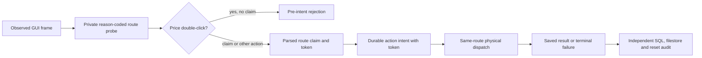

# ADR: explicit train-only Odoo action routes

**Status:** source-only candidate, no native v9 attempt. **Scope:** the frozen Odoo Community train purchase calibration; no selection, hidden or final dispatch.

The [v8 terminal audit](evidence/odoo-v066-train-attachment-route-v8-terminal-2026-09-29.md) found that a price-editor `double_click` lacked a strict price-route claim. A resampled screenshot happened to pass the inherited exact-frame parser, so an action intent was written under the generic RFQ route. The opposite decorative raster then appeared at dispatch and was rejected. The saved evidence does not contain the failed DOM predicate, leaving the missing claim's immediate cause unknown.

The chosen design separates route **classification** from each route's physical-frame policy. Every train observation saves a private, reason-coded price probe. A train RFQ `double_click` must claim the price-editor route or fail before intent; it cannot silently fall back to generic RFQ parsing. After parse, a token binds the selected route, task, frame, normalized action, observed URL and probe bytes. A train-specific journal writes the probe and claim references and route token in the durable action intent before calling dispatch. Dispatch accepts that same token only, checks that the parser's route state still matches, and requires the route's physical guard receipts. The existing four-pixel price equivalence remains restricted to the already frozen positive and wrong-object train RFQ editors; this ADR adds no new raster tolerance.

The alternatives were to keep the nested inheritance fallback, which reproduces v8's parse/dispatch split, or to add a global screenshot tolerance, which would weaken unrelated RFQ and evaluator actions. The explicit router costs one train-only adapter and journal plus a stricter auditor, but keeps historical sources immutable and makes an unclaimed price action observable before intent. Probe and route files stay private and contain reason codes and hashes rather than source values. The public receipt exposes only bounded counts and verification results.

Failure modes remain terminal after intent. A changed frame, target, task, URL, route token, price identity or physical sample rejects dispatch; there is no automatic replay of that attempt. A missing route sink or malformed probe rejects observation. A failed route claim writes a private reason and never becomes a generic double-click. The independent auditor reopens every linked probe and claim, recomputes each token, requires both train price phases, verifies the original GUI positive/wrong-object saved state and full filestore reset, and checks worker lease/service cleanup. This architecture remains unproven in a native run until a separately frozen train-only attempt is executed and audited.

The [v9 public source freeze](evidence/odoo-v066-attachment-train-source-freeze-v9-2026-09-29.json) binds 30 source files, a fresh private nonce and the existing accepted train-only package. The new run directory is `attachment-route-train-pilot-20260929-07`. Eighty-three targeted unit and synthetic-browser tests and offline freeze verification passed; the run directory was absent. No v9 Docker service, GUI action, model call, selection read or official final admission has been executed.
