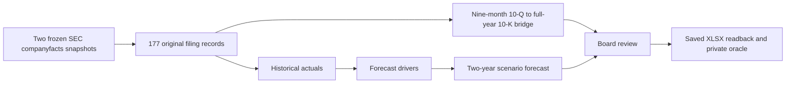

# SEC Q4 bridge blind-audit prototype (2026-09-24)

## Result and admission status

A second **development** Excel task shape now builds offline from the same pinned Apple and Microsoft public SEC companyfacts snapshots. It is a six-sheet blind model-repair task, not another highlighted fill-in exercise. The actor sees 177 authentic, mixed-context filing records and a model containing 114 formulas. Nine formulas were deliberately corrupted without exposing their coordinates or count in the actor instructions. Those faults propagate to 27 incorrect target results in the initial saved workbook. A private, independently computed oracle accepts the full reference repair and rejects the faulty seed.

This is **one prototype task shape using the same two issuer source snapshots**, not an additional independent issuer cohort or 100 ready final cases. One fault was repaired through Microsoft Excel for the web, saved, reloaded, downloaded, and independently read back; the [one-edit receipt](sec-bridge-audit-excel-web-one-edit-2026-09-24.json) records a `1/9` partial repair score and full-task failure. That upload used a pre-normalization package whose worksheet content was byte-identical to the current deterministic build; the two package hashes are distinguished in the receipt. The task has not passed a full GUI solution, clean per-attempt cloud reset, or blinded human difficulty calibration. The public builder reveals this development fixture's faults, so it is ineligible for a hidden final set. An official version would need private generation code/issue manifest and disjoint source families.



## Why this is harder than the five-sheet fill-in prototype

The earlier prototype marks 84 empty formula cells and specifies how to fill them. Here every calculation appears populated. The actor must audit 114 formulas across `Historical`, `Q4 Bridge`, `Drivers`, `Forecast`, and `Board Review` and diagnose which are causally wrong. The source table includes annual 10-K values, nine-month year-to-date 10-Q values, three-month observations, later comparative filings that sometimes carry **the same numeric value**, issuer-specific June/September fiscal ends, USD/share and share units, and modeled assumptions. A wrong filing link can yield the expected static number, yet fail when the canonical filing fact changes privately. Other errors change a sign, denominator, fiscal year, ratio issuer, growth year, or downstream board link. Source records, correct formulas, and non-formula workbook cells must remain intact.

The `Q4 Bridge` computes implied Q4 revenue, operating cash flow, capital spending, operating income, and free cash flow from the FY2024 original 10-K less the matching nine-month FY2024 third-quarter 10-Q. Apple uses filing accessions `0000320193-24-000123` and `0000320193-24-000081`; Microsoft uses `0000950170-24-087843` and `0000950170-24-048288`. The two companies have different fiscal year ends. The FY2025–2026 forecast is explicitly illustrative; no forecast value is presented as an SEC fact or company guidance.

## Reproduction and verification

The source builder is [`build_bridge_audit.py`](../../sec_excel_factory/build_bridge_audit.py), the actor brief is [`BRIDGE_AUDIT_TASK.md`](../../sec_excel_factory/BRIDGE_AUDIT_TASK.md), and the separate evaluator is [`verify_bridge_audit.py`](../../sec_excel_factory/verify_bridge_audit.py). The evaluator reads saved `.xlsx` OOXML independently of the authoring package and computes expected values from the frozen SEC JSON again. The private reference workbook is used only to identify which seed formulas may change; its cached/formula results are not the scoring oracle.

```bash
python3 sec_excel_factory/build_bridge_audit.py sec_excel_factory/output/bridge_audit
python3 sec_excel_factory/verify_bridge_audit.py \
  sec_excel_factory/output/bridge_audit/private/reference.xlsx \
  sec_excel_factory/output/bridge_audit/actor/task.xlsx \
  sec_excel_factory/output/bridge_audit/private/reference.xlsx
python3 -m unittest discover -s sec_excel_factory -p 'test_bridge_audit.py' -v
```

Observed locally on 2026-09-24: the positive reference passed `114/114` target computations and two private replay profiles. The unsolved actor seed failed with 27 wrong derived results. Nine targeted tests passed, including a same-value wrong-filing link, a static hardcode, source tampering, a regression to an already-correct formula, isolated partial credit for one repaired fault, and byte-identical rebuilds. Each replay perturbs all **36 canonical source facts** (28 annual and eight nine-month facts) with distinct values, plus both scenario multipliers, without altering the actor workbook. The second replay changes all 114 expected target values. This checks source provenance and dependency propagation more broadly than a single changed source cell.

The verifier returns a `repair_score` from 0 to 1 in ninths. It evaluates each of the nine causal repair locations with other target cells held at independently computed values, so one correct root repair earns `1/9` even if other faults still propagate through the workbook. Any change outside the allowed fault sites, including to a previously correct formula, zeros the score. Full pass still requires all 114 target values and both replay profiles to be correct. These feedback fields are for local qualification; an official benchmark must keep the private fault map and replay results evaluator-side.

The generated actor workbook at `sec_excel_factory/output/bridge_audit/actor/task.xlsx` is 26 KB, SHA-256 `3f74ee941b49ed07859d89e1be8fc13e77b69584f0edc1e56c7b891d4ba0eec6`. The private reference workbook is 26 KB, SHA-256 `23030948bb60cf1fc2db70aadc7a33c0346907458ed363a346f4ad34c347ae87`. The builder fixes workbook metadata and package timestamps, so two builds in different directories yielded these same byte hashes. Both generated outputs remain ignored rather than included in the public repository. The pinned raw JSON digests and SEC source/rights information are in the [SEC Excel prototype README](../../sec_excel_factory/README.md).

## Remaining validity gates

1. Run a complete visible-UI repair with an agent that sees only the actor package; check the final saved workbook against all 114 target values, hidden replays, and no-regression constraints. The observed one-edit save/readback does not satisfy this gate.
2. Create a fresh isolated workbook copy per attempt and verify reset/version checksums. Audit any Excel-web normalization before admitting the task.
3. Build genuinely distinct issuer/workflow families with unpublished fault maps and independent source cohorts. The current two snapshots and public code cannot support claims about 100 novel, hidden final tasks.
