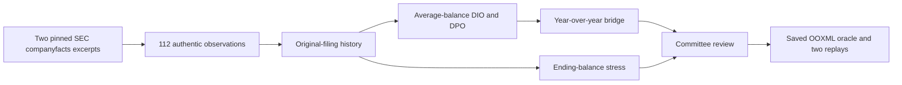

# SEC retail working-capital development prototype (2026-09-24)

## Admission status

A **third Excel development task shape** now uses frozen, authentic SEC companyfacts for Costco and Walmart. This is a separate issuer cohort from the Apple/Microsoft bridge audit and a different workflow: retail inventory and trade-payables analysis rather than annual financial forecasting. The actor receives a five-sheet workbook with 112 authentic SEC companyfacts observations, including annual and quarterly records, and 92 populated formulas; nine formulas are deliberately wrong without visible fault markers. The raw full SEC downloads remain in ignored `work/sec-expansion/raw`; the 44 KB [frozen excerpt](../../sec_excel_factory/sources/retail_excerpt.json) contains the exact authentic observations used by the workbook, source URLs, CIKs and raw response hashes. The excerpt is public development data, not a hidden final set.

The positive reference workbook passed an independent saved-OOXML oracle on all 92 targets plus two evaluator-side source/scenario replay profiles. The replay vectors are public in this development fixture, not sealed final-set tests. The unrepaired seed failed and received 0/9 isolated repair credit. A same-value link to an earlier filing passed the static numeric value yet failed a source perturbation. Hardcoding, source tampering and changing an already-correct formula were also rejected. Eight targeted tests passed, including a byte-identical rebuild and audit-to-excerpt source-hash check.

The workbook was subsequently uploaded into **real Microsoft Excel for the web** under the dedicated test account. The human operator repaired one formula through the visible UI, waited for cloud save, reloaded, downloaded the artifact, and received `1/9` isolated repair credit with a full-task failure. Continuing on the same cloud file, the operator repaired all nine formulas, saved/reloaded/downloaded again, and passed the independent oracle at **92/92 targets plus both evaluator-side replays**. Independent OOXML readback found exactly nine changed formulas matching the evaluator-only reference, no non-formula source-value changes, and preserved checked sheet/table structure.

The operator then manually reverted all nine formulas through that **same Excel web file**, saved, reloaded, and downloaded it. The reset artifact's formula texts, non-formula source values, sheet order, tables, and checked structure match the seed. Excel had populated 92 formula-result caches, so the file is not byte-identical to the initial package; independent evaluation found all 92 cache values current for the reset formulas, with no stale positive result carried over. The independent oracle returned `0/9` repair credit and full-task failure, as expected for the restored faulty seed. The [field-limited web-control receipt](sec-retail-working-capital-excel-web-controls-2026-09-24.json) binds the seed, partial, full, and reset artifacts plus private oracle outputs by SHA-256 without publishing account links or workbook binaries. These are **human development controls**, not a Qwen score or an official benchmark result. Manual same-file rollback is observed; an automated fresh-attempt reset, a separate independent full-positive run, and comprehensive visual-style equivalence remain unverified.

## Why it differs from the earlier SEC workbook

The old bridge audit derives a fourth quarter from a nine-month 10-Q, then forecasts revenue and free cash flow. The new task reconciles **three fiscal-year balance dates** with **two full-year cost flows** to compute average-balance inventory days (`DIO`), payable days (`DPO`), net trade investment, year-over-year changes, and an ending-balance stress scenario. Costco's FY2023 spans 371 inclusive days and its FY2024 spans 364; Walmart's respective periods span 365 days. Costco reports cost of goods and services sold while Walmart's relevant concept is cost of revenue. The shared display label therefore cannot be used as a source tag. Both issuers' FY2022 opening balances come from their original FY2023 10-Ks, while FY2023/24 facts use their original FY2024 10-Ks. Later comparative filings include identical reported values, which makes filing-lineage errors invisible to static-value checks.

The stress sheet changes FY2024 ending inventory and ending payables; it must recalculate averages before days metrics. This is an illustrative scenario, not issuer guidance or an SEC-reported result. DPO is a limited trade-payables proxy, not a complete cash conversion cycle.



## Reproduction

The [issuer audit summary](../../sec_excel_factory/candidate_audit_fetched_2026-09-24.json) records the SEC URL and SHA-256 of each frozen full response. To regenerate the excerpt, put the two previously checked-in snapshots in the ignored cache, then fetch the 16 missing issuers with the repository's bounded SEC qualifier. Set `SEC_CONTACT_USER_AGENT` privately to a genuine organization and contact address before running:

```bash
mkdir -p work/sec-expansion/raw
cp sec_excel_factory/sources/raw/apple-companyfacts.json.gz work/sec-expansion/raw/
cp sec_excel_factory/sources/raw/microsoft-companyfacts.json.gz work/sec-expansion/raw/
SEC_USER_AGENT="$SEC_CONTACT_USER_AGENT" python3 sec_excel_factory/qualify_candidates.py \
  --snapshots work/sec-expansion/raw --output work/sec-expansion/candidate_audit_full.json \
  --fetch --max-fetch 16 --delay 1.0
python3 sec_excel_factory/extract_retail_sec.py --snapshots work/sec-expansion/raw
python3 sec_excel_factory/build_retail_working_capital.py sec_excel_factory/output/retail_working_capital
python3 sec_excel_factory/verify_retail_working_capital.py \
  sec_excel_factory/output/retail_working_capital/private/reference.xlsx \
  sec_excel_factory/output/retail_working_capital/actor/task.xlsx \
  sec_excel_factory/output/retail_working_capital/private/reference.xlsx
python3 -m unittest discover -s sec_excel_factory -p 'test_retail_working_capital.py' -v
```

The extractor validates the frozen raw response hashes before writing the excerpt. The evaluator independently selects source facts from the hash-pinned excerpt and computes all expected outputs; it does not import the workbook builder or accept cached Excel values. The private reference workbook only identifies the nine allowable formula repair sites. The development builder and fault map are public, so this case cannot be reused as an official hidden final task. A future official version needs unpublished defect generation, disjoint issuer/workflow families, isolated per-attempt reset, and real Excel GUI admission.
