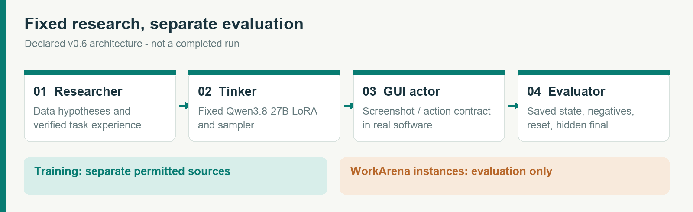
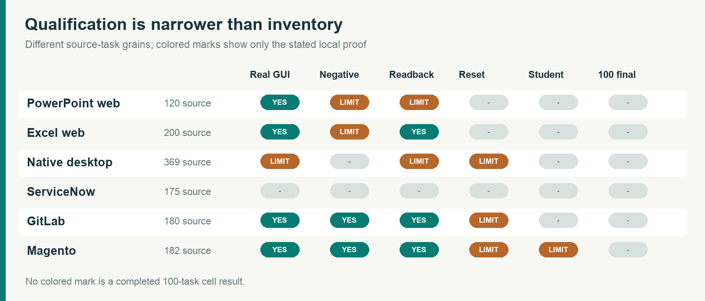
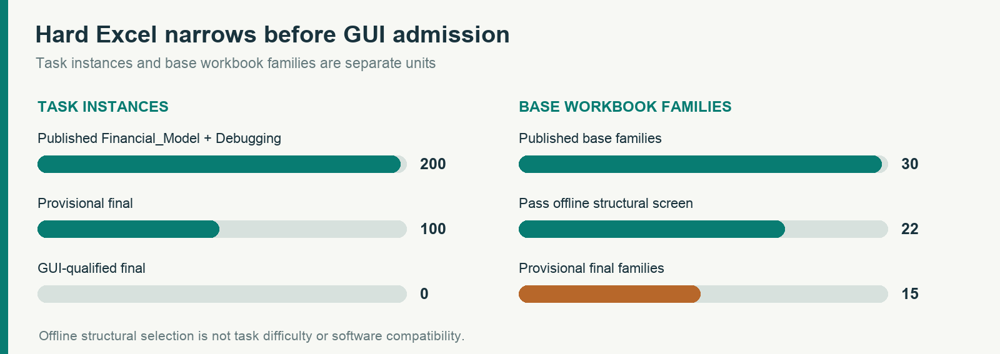
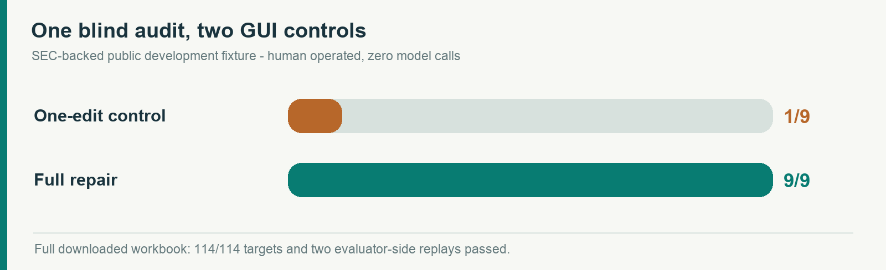
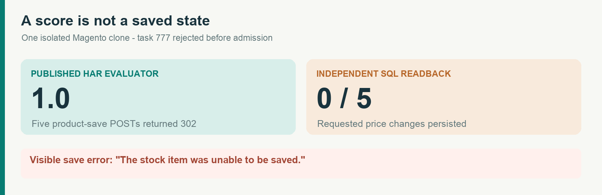

# EnvLoop Computer-Use Benchmark: Real-Software Qualification Note

EnvLoop | Version 0.6 | 24 September 2026

**Status.** This document reports environment and verifier qualification, not results from the planned full-scale researcher experiment. No application has an admitted 100-task final set. None of the 24 researcher campaigns or 600 distinct official final task instances has run. The earlier v0.5 Kanboard study uses a different student and remains a separate, immutable result.

## Abstract

We are building a controlled data-research benchmark in which four researcher configurations propose training experience for a fixed Qwen3.8-27B computer-use student. Six real-software application cells are proposed: PowerPoint for the web, Excel for the web, native desktop applications, ServiceNow, GitLab, and Magento administration. Each cell is intended to have 20 selection and 100 official final instances. A task enters the official set only after its application loads, a positive GUI solution reaches the saved state, a plausible negative fails, an independent evaluator reads the saved artifact or database, and a fresh attempt can reset without leaking answers. Task counts in upstream datasets are only source inventories.

This note documents what has passed those narrower probes. An SEC-grounded blind financial-model audit was completed by a human through the visible Excel web interface: nine repairs passed 114 independently recomputed targets and two source/scenario replay profiles after save, reload, and download. A one-repair control failed the complete task and earned isolated 1/9 repair credit. Magento administration has a scripted order-address GUI positive, wrong-order negative, database readback, and transactional restore; a separate Qwen3.8-27B base-model navigation pilot reached one official task. A second Magento mutation was rejected when a network-only score of 1.0 contradicted visible save failure and unchanged prices. PowerPoint web exposed substantial package rewriting on save, motivating a paired Office-normalized artifact guard. E2B Desktop successfully saved a synthetic XLSX in LibreOffice Calc. These are distinct evidence types; none is a 100-task cell result or evidence of trained-model improvement.

---PAGEBREAK---

## 1. Evaluation question and boundary

The target question is whether a researcher can turn observed computer-use failures into better training data for one fixed student while the training and evaluation services remain constant. The protocol adopts the controlled-research boundary in reference [1], but the application environments, task sources, action contract, and scores here are separate. Researcher configurations are gpt-6-astra, gpt-5.6-sol, gpt-6-sol, and gpt-6-luna. The fixed rollout teacher is gpt-5.6-sol. The planned student is Qwen/Qwen3.8-27B. A synthetic-image Tinker LoRA update and checkpoint sample passed, and one base-model screenshot/action pilot succeeded in Magento. No cell-specific trained checkpoint or matched researcher comparison is reported in this note.

The actor sees only the task instruction and declared GUI observations. The evaluator owns source snapshots, gold or rule-based oracles, hidden perturbations, saved-state readback, and scoring. The researcher may revise data strategy from selection feedback, but official final tasks and outcomes remain sealed until checkpoint choice. The provisional 100-task chunk planner, campaign budget ledger, and screenshot/action envelope are implemented as preparation controls; their existence is not a remote-dispatch receipt.

For ServiceNow, the official WorkArena instances are limited to benchmarking, evaluation, and research, with no training, production use, or sensitive data storage. Training experience for that cell must therefore come from a separate permitted source. A [browser-observed access request](https://github.com/EnvLoop/cua-rsibench/blob/main/docs/evidence/workarena-access-request-2026-09-24.json) to the gated instance repository was submitted on 24 September 2026 and was awaiting author review at the time of this note. No ServiceNow instance task has run.

## 2. Application inventory and admission state

The six source inventories contain 120 PowerPoint tasks, 200 hard Excel financial/debugging instances, 369 OSWorld desktop IDs, 175 WorkArena compositional candidates, 180 GitLab-only tasks, and 182 Magento-admin tasks. These counts have different grains and cannot be summed into an evaluated benchmark denominator. The Excel 200 instances share 30 base workbooks; the 180 GitLab tasks collapse to 41 intent templates. The provisional Excel split contains 100 final candidates from 15 base workbooks, not 100 independent financial models.

| Cell | Narrowest observed positive | Key missing admission evidence |
| --- | --- | --- |
| PowerPoint web | One title-size edit saved and read back; paired normalized artifact guard accepted | Automatic pre-actor baseline, official renderer, 100 task resets |
| Excel web | One human SEC blind-audit full repair passed the independent saved-workbook oracle | Student GUI run, 100 hidden final instances with audited family diversity, automated reset |
| Native desktop | One E2B Linux Calc workbook saved and read back | An OSWorld task, mixed-app image, per-task evaluator and reset |
| ServiceNow | Gated access request submitted | Instance approval and any live task execution |
| GitLab | Navigation plus one milestone GUI mutation on a minimal local project | Original populated seed, current-date task realism, 100-task admission |
| Magento | Navigation and one order-address mutation controls | Coverage and resets for 100 admitted tasks |

All six cells have zero admitted 100-task official sets. Where a test succeeds, we identify its exact application, data source, actor, verifier, and reset scope instead of transferring the claim to another surface.

## 3. Hard Excel: source realism and causal repair

[SpreadsheetBench 2](https://arxiv.org/html/2606.29955) supplies 100 financial-model and 100 debugging instances. Direct inspection of the pinned archive found 30 distinct base workbook files. A deterministic family-disjoint triage assigned 20 selection candidates from three families and 100 provisional final candidates from 15 families. The final families' first inputs have 7-25 sheets and 1,014-73,063 existing formulas; this is structural screening, not a difficulty score or a compatibility guarantee. The 25-sheet Education example opened in Excel web, but an untouched save removed two VML Note drawings. Its offline oracle found 82 genuine blank-to-formula targets and rejected wrong-target and unrelated edits. It still lacks a complete GUI solution and whole-workbook preservation admission. The paper and dataset card disagree on the data license; this release does not redistribute the workbooks or gold files.

To test a different failure mode, we authored a six-sheet blind audit from frozen [SEC EDGAR companyfacts](https://www.sec.gov/search-filings/edgar-application-programming-interfaces) records for two issuers. The visible Raw SEC sheet holds 177 authentic mixed-context records, including original and later filings, nine-month and three-month periods, distinct fiscal calendars, and units that can mislead a superficial match. The model contains 114 formula targets and nine injected causal faults. The actor brief discloses neither their coordinates nor their count. Historical actuals, a nine-month-to-full-year fourth-quarter bridge, ratios, a two-year illustrative forecast, and a board view are linked across sheets. The forecast is a modeled scenario, not company guidance.

An evaluator independent of the workbook builder recomputes 114 target values from the frozen source and applies two evaluator-side replay profiles that perturb 36 canonical filing facts and both scenario inputs. The replay vectors are public in this development fixture; they are not sealed final-set tests. Static numbers and same-value links to the wrong filing fail those replays. A human positive control repaired all nine formulas through Excel web, waited for save, reloaded the workbook, and downloaded it. Independent OOXML readback found nine changed formulas matching the privately stored reference workbook, no non-formula source-data changes, preserved checked sheet/table structure, and a full 114/114 plus replay pass. A separate one-repair GUI control persisted but failed the complete task; isolated causal credit was 1/9. Neither control is a student-model score. The public development builder reveals its fault map, so this fixture cannot enter a hidden official final set.

## 4. Cross-application verification lessons

In Magento, published WebArena Verified task 538 changed the billing address of one order through the real admin GUI. The unchanged official evaluator scored the target save 1.0 and a plausible save on another order 0.0. Independent SQL readback confirmed the correct address row and denormalized order-grid row changed; a transactional restore returned five monitored business-table hashes to baseline after each case. This establishes one mutation workflow, not general Magento reset. A separate base Qwen3.8-27B pilot completed the easier customer-list navigation task 157 with five applied GUI actions and a valid official score of 1.0. Three prior protocol-development attempts remain 0, 0, and unscored. We do not pool them into a model success rate or claim training improvement.

A second Magento probe exposed a rejection that a network-only score would have missed. For task 777, five visible price-save requests returned HTTP 302 and the unchanged published HAR evaluator scored 1.0 on both raw and sanitized traces. The page displayed a stock-item save error, while independent SQL found all five target prices unchanged at USD 52. The local clone reported an unavailable search service. The qualification gate therefore rejected this task as unscored; a wrong-color negative was not attempted after the positive failed to persist. This is one clone-specific failure, not a claim that every WebArena Magento installation behaves the same way.

PowerPoint web requires a different preservation rule. An untouched source deck and an Office-saved no-task-change control differed in 79 package parts. The Office-saved control and a 48-point title edit differed in only the target slide plus four derived metadata or thumbnail parts. A narrow opt-in guard passes the paired normalized artifact while rejecting unrelated slide or media edits. The case still needs an evaluator-owned control frozen before the actor and an official PPT-Eval renderer result. Treating arbitrary package changes as harmless would hide regressions; treating every Office rewrite as an actor error would reject valid work.

An E2B Desktop sandbox launched Linux LibreOffice Calc, entered synthetic data by GUI, saved an XLSX, and passed independent XML readback for two cells before the sandbox was killed and confirmed stopped. This is a desktop transport smoke, not Microsoft Excel desktop or an OSWorld score. GitLab added one real GUI milestone mutation on a minimal local project: correct, wrong-due-date, and correct submissions scored 1.0, 0.0, and 1.0 through the pinned evaluator, with database readback and all three monitored resets. The synthetic seed and already-expired 2023 dates make it an infrastructure probe, not an original populated WebArena environment or a realistic final task.

Across surfaces, a meaningful positive is a saved artifact or application state, not a successful click trace alone. A useful negative changes the wrong object or leaves another defect. Reset must restore the complete monitored state and be repeatable on fresh attempts. Infrastructure-invalid attempts remain unscored, not silent task failures.

## 5. Current study status and release boundary

The planned matrix is four researcher configurations by six application cells, with 20 selection and 100 final instances per cell. That means 24 planned research campaigns and 600 distinct official final task instances shared across the four researcher comparisons within each cell. As of this note, **0/24 campaigns and 0/600 official final instances have run**. No cell has 100 tasks that pass build, GUI save/readback, positive and negative evaluation, source isolation, and reset. The nominal Tinker cap is USD 500 per campaign and 16 hours; USD 12,000 across campaigns is an authorization ceiling, not an observed bill or forecast. E2B, researcher inference, storage, and software costs require separate reconciliation.

The next admissible result requires a frozen source manifest, one source-disjoint 100-task set per cell, real Qwen3.8-27B observation/action compatibility on that cell, a reproducible training checkpoint, and evaluator-owned task reset. WorkArena approval alone does not satisfy those gates. This note is published to make the qualification evidence reviewable while the full matched experiment remains open. A later results report must use actual campaign receipts, failure denominators, costs, checkpoint selections, and official final scores rather than promoting these one-task controls into a benchmark result.

## References and evidence

[1] [RSIBench-Data](https://arxiv.org/pdf/2607.25886). Controlled data-research benchmark reference. [2] [SpreadsheetBench 2](https://arxiv.org/html/2606.29955). Hard spreadsheet source. [3] [SEC EDGAR XBRL APIs](https://www.sec.gov/search-filings/edgar-application-programming-interfaces). Public filing facts. [4] [WorkArena](https://github.com/ServiceNow/WorkArena). ServiceNow task and access rules. [5] [OSWorld](https://github.com/xlang-ai/OSWorld). Desktop task inventory. [6] [WebArena Verified](https://github.com/ServiceNow/webarena-verified). Magento and GitLab task/evaluator source. All local task evidence, source revisions, hashes, and verifier limits are linked from the public repository's `docs/evidence/` directory. No private account credentials, raw authenticated browser traces, or evaluator-only workbook answers are included in this publication.

## Appendix A. Auditable control ledger

| Probe | Observed control | Admission boundary |
| --- | --- | --- |
| SEC blind Excel audit | [One repair](https://github.com/EnvLoop/cua-rsibench/blob/main/docs/evidence/sec-bridge-audit-excel-web-one-edit-2026-09-24.json) 1/9; [human full repair](https://github.com/EnvLoop/cua-rsibench/blob/main/docs/evidence/sec-bridge-audit-excel-web-full-positive-2026-09-24.json) 9/9 and 114/114 | Public development fixture; no model score or hidden final task |
| SpreadsheetBench 2 financial model | [Offline 01_01 oracle](https://github.com/EnvLoop/cua-rsibench/blob/main/docs/evidence/hard-excel-v2-01-01-oracle-2026-09-24.json) accepts gold and rejects two mutations | No GUI-positive solution; Office removed two Note drawings |
| PowerPoint web | [48-point title artifact](https://github.com/EnvLoop/cua-rsibench/blob/main/docs/evidence/v0.6-ppt-web-normalization-control-2026-09-24.md) passes paired Office-normalized guard | No automatic pre-actor control or official renderer score |
| GitLab milestone | [Task 590](https://github.com/EnvLoop/cua-rsibench/blob/main/docs/evidence/gitlab-milestone-mutation-2026-09-24.json) GUI positive / wrong date / positive = 1/0/1; DB readback and reset | Minimal synthetic project with past dates, not original populated seed |
| Magento order address | [Task 538](https://github.com/EnvLoop/cua-rsibench/blob/main/docs/evidence/magento-order-address-mutation-2026-09-24.json) GUI positive 1.0 / wrong order 0.0; DB readback and rollback | One mutation, not general 100-task reset |
| Magento variant prices | [Task 777](https://github.com/EnvLoop/cua-rsibench/blob/main/docs/evidence/magento-variant-price-rejection-2026-09-24.json) network score 1.0 but 0/5 prices persisted | Rejected as unscored in the isolated clone |
| E2B Desktop Calc | [Synthetic XLSX](https://github.com/EnvLoop/cua-rsibench/blob/main/docs/evidence/e2b-desktop-smoke-2026-09-24/receipt.json) saved and two cells independently read back | Linux Calc transport smoke, not Excel desktop or OSWorld |
