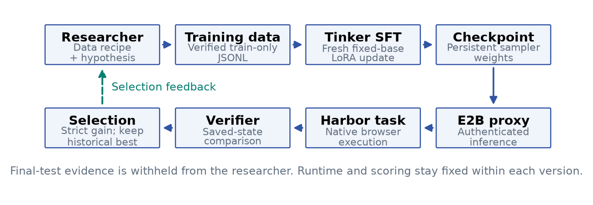
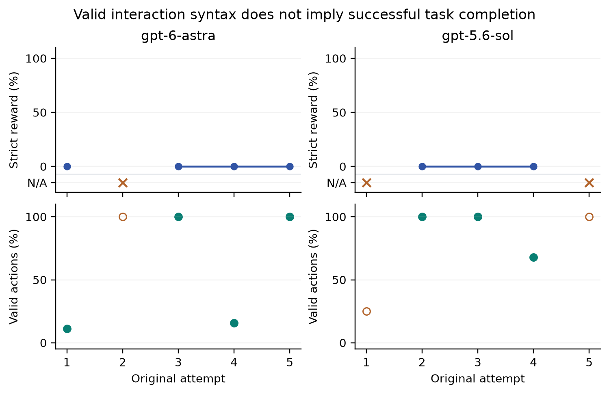
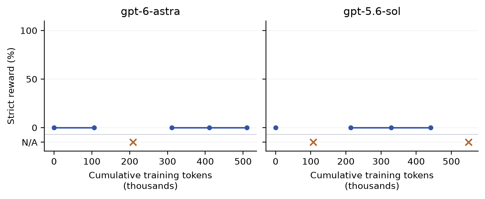
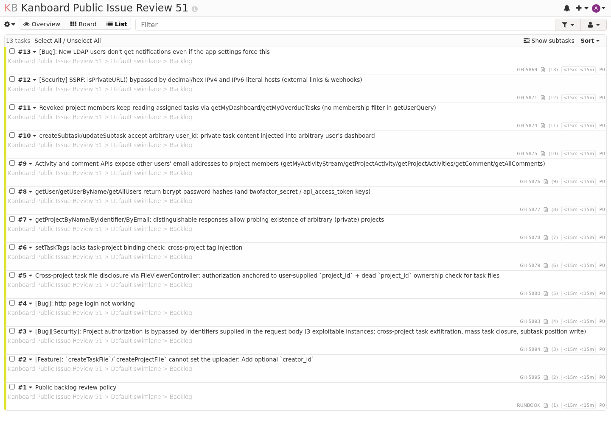

# CUA-RSIBench: Data-Centric Research for Verifiable Computer Use

[Code and evidence: github.com/EnvLoop/cua-rsibench](https://github.com/EnvLoop/cua-rsibench)

## Abstract

Evaluating data research for computer-use agents requires separating learning outcomes from failures of the surrounding software and execution services. We introduce CUA-RSIBench, a controlled pilot connecting researcher-proposed demonstration selection to real LoRA training, checkpoint serving, browser execution, and independent saved-state verification. The environment is unmodified Kanboard, populated with public GitHub issue metadata and explicitly constructed workflow constraints. Two researchers, gpt-6-astra and gpt-5.6-sol, each conduct five attempts for a fixed Qwen3.5-4B student. The ten attempts consume 1,058,908 scheduled training tokens. All seven originally scored candidates receive zero strict task reward; three original evaluations are infrastructure-invalid. Neither campaign promotes a checkpoint over its matched baseline. Separate frontier-model calibration demonstrates native-workflow solvability and a planning task that distinguishes two executions. Trace analysis shows that valid GUI actions can coexist with complete task failure. We release versioned observation and transport repairs, preserve the original failures, and report recovery runs separately. The evidence establishes an executable research pipeline and a negative pilot result, not sustained recursive improvement or broad computer-use generalization.

## 1. Introduction

A browser agent may repeatedly open the same record, choose a feasible but suboptimal plan, fill a form without saving it, or modify the wrong project. Valid interaction syntax is therefore insufficient to establish task success. Evaluating whether training data improve such an agent requires a verifiable connection between its actions and persistent application state.

CUA-RSIBench studies this problem through a bounded data-research loop. A frontier model proposes a dataset for a separate student; shared services train and serve that student; the student operates a real application; and an independent verifier checks the resulting state. Infrastructure errors remain distinct from valid task failures. This distinction matters when a training attempt may otherwise be rejected because an observation or sandbox connection failed.

Our contributions are an executable Kanboard environment with reset and state verification, a real Tinker-E2B-Harbor training and evaluation chain, and an auditable two-researcher pilot with ten training attempts. The empirical finding is negative: high action validity did not yield successful task completion in this setting. The released track uses visible DOM text and controls. It does not measure pixel-only grounding or operation of a complete Windows or macOS desktop.

## 2. Related Work and Scope

RSIBench-Data evaluates researcher agents through a fixed post-training service boundary [1]. It separates data decisions from training and execution infrastructure and analyzes attempted candidates as well as selected checkpoints. Its study uses a larger student, a broader synthesis interface, and multiple task families. Our pilot adopts this separation while restricting research to selection and validated augmentation of verified browser demonstrations. It is a limited adaptation, not a reproduction of the full search space.

OSWorld provides a reference for evaluating tasks in real computer environments [2], while BrowserGym provides a common environment for web-task automation [3]. We add a data-research layer around a small native-browser task family. We do not report OSWorld or BrowserGym results, and their coverage must not be attributed to this release.

Kanboard [4], Harbor [5], Tinker [6], and E2B [7] are existing systems. The benchmark contribution concerns their task and data contracts, isolation boundaries, independent verification, and experimental records. Installing these components alone would not establish a benchmark result.

## 3. Evaluation Task and Protocol

### 3.1. Researcher, student, and experimental unit

Let M0 be the fixed student and H(<t) the permitted history before attempt t. Researcher r observes training sources and aggregate feedback, then proposes dataset D(r,t). Each attempt creates a fresh LoRA adapter from M0 under the same configuration c: D(r,t) = R(r)(S_train, H(<t)), followed by M(r,t) = Train(M0, D(r,t); c). The previous checkpoint is not the starting weights for the next attempt.

A research attempt is the unit of data-policy comparison; a browser execution is the unit of task evaluation. Repeating the same task checks execution stability, not task diversity. Astra and Sol are the researchers, while Qwen3.5-4B is the trained student. Their direct GUI calibration results describe a different role and are reported separately.

### 3.2. Fixed infrastructure and actor permissions

Tinker performs actual LoRA updates and saves sampler checkpoints. An authenticated temporary E2B proxy serves a checkpoint. Harbor launches an E2B task environment and a separate verifier environment. The application is Kanboard 1.2.54 with its original PHP controllers, forms, comments, projects, and SQLite persistence. Setup uses the application API before the actor starts; those operations are not credited as agent work.

The actor receives visible page text, control references, working memory, and the previous action outcome. It can click, fill, select by label, press a limited key, go back, or finish. It cannot execute shell commands, query SQL, call application APIs, edit files, or choose arbitrary URLs. Screenshots are retained for audit but are not model inputs. Expected targets are excluded from the actor task package.

### 3.3. Real-source data and constructed tasks

The snapshot contains 37 public issue metadata records from kanboard/kanboard. Each record retains its issue number, capped title, state, timestamps, labels, comment count, and source URL. Collection time and content hash are recorded. Issue bodies, author profiles, and email addresses are excluded.

Issue facts are source-real. Staff identities, project names, assignment policies, archive distractors, planning costs, dependencies, and capacity limits are benchmark constructs. They are not represented as actual upstream maintenance decisions or budgets. The information required to solve a task is available through the application.

| Partition | Source records | Permitted use |
| Train: pack 51 | 12 unique issues | Verified teacher demonstrations |
| Selection: pack 52 | 12 different issues | Aggregate candidate feedback |
| Final: pack 53 | 12 different issues | Evaluation after selection is frozen |

**Table 1.** Source-ID-disjoint partitions. One record is unused by these packs. The workflow template is shared; this is not template-disjoint or application-disjoint evaluation.

The research task selects the three oldest-updated unresolved source issues, changes only their assignee, priority, and complexity, and preserves other state. A separate planning calibration adds value maximization, capacity limits, dependencies, exclusions, and minimum-cost tie-breaking. Constructed revision-triage fixtures are also available, but do not enlarge the reported data-research evaluation set.

### 3.4. Independent saved-state verification

The trusted evaluator captures initial and final application state. It constructs the expected final state from the initial snapshot and hidden target changes, then compares tasks and related business tables. Success requires both the intended updates and preservation of unrelated objects, descriptions, comments, and project relationships. A model cannot earn reward by asserting completion.

Known native-form equivalences are normalized narrowly: application-maintained timestamps, null versus zero time fields, and LF versus CRLF line endings. Other content changes remain visible to the verifier. Earlier false rejections caused by these equivalences were regraded, with original and corrected results retained. Negative checks cover wrong objects, missing or extra records, altered comments, and unauthorized changes.

Strict saved-state success is the primary binary reward. When inference, observation, execution, or artifact collection prevents valid verification, reward is undefined. We retain the exception stage and partial trajectory instead of assigning zero. Target completion and action validity are diagnostics; they cannot promote a checkpoint.

### 3.5. Selection and final evaluation

Each campaign evaluates a matched unadapted baseline. A candidate is promoted only when its selection reward strictly exceeds the current best. Ties retain the earlier model, including the baseline. After search, a final-selection record is written before final tests begin. The researcher receives no final-test inputs, traces, or scores for additional adaptation.

Three final executions use pack 53 with the same seed and temperature. A complete mean is reported only when all three yield valid scores. Partial observations and recovery executions remain separate. These repetitions test execution stability and cannot support confidence intervals over task diversity.

## 4. Experimental Setup

### 4.1. Researcher inputs and the data contract

The researchers are gpt-6-astra and gpt-5.6-sol, accessed through AgentRouterHub Responses requests at low reasoning effort. Both receive the same verified inventory and three identical full representative examples. The teacher is a successful Sol trajectory on pack 51, independently checked against saved state.

A recipe selects 1-32 demonstration IDs, with repetition allowed. It may apply a consistent permutation of numeric control references in the observation and corresponding action. The transformation changes observer references, not source facts or expected outcomes. Researchers receive aggregate selection feedback and the previous recipe rather than unrestricted evaluation traces.

Training and evaluation use semantically similar but different instruction headers. This remains a documented confound. Model names are requested provider identifiers; the experiment does not independently attest the underlying hosted model identity.

| Component | Fixed configuration |
| Student | Qwen/Qwen3.5-4B |
| Training | 16 updates; batch 2; LoRA rank 8; learning rate 0.0001; seed 23 |
| Data limits | 32 records; 16,384 tokens per sequence; 262,144 scheduled tokens per attempt |
| Search budget | 5 attempts; 1,048,576 scheduled training tokens per researcher |
| Wall-time gate | 10,800 seconds checked before the next attempt; baseline and final evaluation excluded |
| Sampling | Temperature 0; seed 23; at most 512 output tokens |
| GUI evaluation | 90 actions; 1,500-second agent timeout; separate verifier |
| Runtime | Kanboard 1.2.54; Harbor 0.23.0; Tinker 0.30.0; E2B 2.51.0 |

**Table 2.** Frozen configuration. The wall-time condition gates new rounds rather than interrupting an active attempt. Scheduled training tokens include masked prompt tokens and are not a dollar estimate.

### 4.2. Evidence, versions, and resource accounting

The original campaigns use the runtime recorded at commit 62b99b9. Source hashes are checked during search and before final evaluation. Training files, recipes, usage receipts, checkpoints, trajectories, verifier reports, and selection records are retained. Public summaries include content hashes but exclude credentials and account-specific checkpoint identifiers. Dollar costs remain unknown because authoritative account pricing was not available.

Repairs are versioned separately. A faster observer or stronger transport recovery cannot silently change the interpretation of an ongoing experiment. We distinguish original executions, transport-only replays with the original checkpoint and observer, and integration checks for the new observer.

## 5. Results and Analysis

### 5.1. Native-workflow calibration

| Task / actor | Actions | Strict outcome |
| basic-51 / 5.6-sol | 8 | Pass |
| public-allocation-51 / 6-astra | 49 | Fail |
| public-allocation-51 / 5.6-sol | 47 | Pass |
| public-51 / 5.6-sol | 59 | Pass |

**Table 3.** Direct frontier-actor calibration. These individual executions are not a model leaderboard or student-training results. Seven other direct calibration executions were infrastructure-invalid and remain in the evidence index.

The planning pair provides a concrete example of discrimination. Astra selected a feasible maximum-value set with value 49 and cost 62. The required tie-break prefers another value-49 set costing 52, which Sol selected. The verifier rejected the former and accepted the latter. This concerns two executions under a constructed planning policy, not a population-level model ranking.

### 5.2. Candidate outcomes and checkpoint selection

| Researcher | Scored / invalid | First / best / last valid | Selection | Train tokens |
| 6-astra | 4 / 1 | 0% / 0% / 0% | Base | 510,182 |
| 5.6-sol | 3 / 2 | 0% / 0% / 0% | Base | 548,726 |

**Table 4.** Original candidate outcomes. “Last valid” excludes interrupted attempts: Sol attempt 5 has no original score. Neither search observes a strict gain over its matched baseline, so both retain the base student.

All seven originally scored candidates fail the strict task and complete zero of three target records. The remaining three cannot be classified by capability because evaluation was interrupted. First-to-best gain among scored candidates is zero for each researcher. This is a negative result within the current search space and budget, not a conclusion that either researcher can never discover useful data.

### 5.3. Resource use and selected-model evaluation

The searches schedule 1,058,908 training tokens across 160 optimizer updates. Astra uses 510,182 tokens and Sol uses 548,726, both below their individual caps. Additional training expenditure improves neither the best observed strict score nor target completion. Inference tokens, retries, and wall time are separate resource dimensions; unavailable charges are not reported as zero.

| Researcher selection | Final executions 1 / 2 / 3 | Complete mean |
| 6-astra -> Base | Infra / 0% / 0% | N/A |
| 5.6-sol -> Base | Infra / Infra / 0% | N/A |

**Table 5.** Original post-selection executions on pack 53. Both campaigns select the same base student. An incomplete three-execution statistic is withheld; N/A is not an average of zero.

### 5.4. What the trajectories establish

Astra attempt 3 issues valid actions throughout its 90-step budget while repeatedly alternating between the list and the same issue. Other candidates also achieve high action validity without completing a target record. Correctly formatted clicking is therefore a weak proxy for retaining facts across pages, choosing the right objects, and verifying saved changes.

Researcher hypotheses evolve from reference grounding toward coverage of discovery, memory, editing, saving, and stopping. These are recorded hypotheses, not causal findings. No single-factor ablation isolates data composition, memory quality, prompt mismatch, or insufficient training exposure. The observed behavior supports a workflow-completion failure, but does not uniquely identify its cause.

### 5.5. Infrastructure recovery

The original runtime can fail while collecting observations or when E2B closes a connection before command output returns. Read-only retries recover Astra attempt 2 and Sol attempt 5, both with reward zero. Sol attempt 1 then encounters a transport failure during an action. Blindly replaying that action could duplicate a submission.

Journaled transport assigns each logical command a stable request ID and stores its result. Repeated dispatch retrieves the saved result; an intent without a completed result fails closed rather than rerunning possibly completed effects. Local checks cover concurrent duplicates, lost-result retrieval, ID collisions, and incomplete intents. These are engineering guarantees tested at the command boundary, not evidence of a stronger student.

The new observer batches DOM collection, binds actions to original element objects, excludes closed-details content, isolates active modals, and bounds screenshot time. Control lists match on five real nonmodal Kanboard surfaces. With five measurements per surface, the slowest page median falls from 4.115 seconds to 0.0092 seconds. This measures snapshot code, not end-to-end agent speed. A separate Sol native-edit run under the repaired stack passes independent verification with reward 1 and no infrastructure error.

| Journaled replay | Status | Reward |
| shared-final-0 | scored | 0% |
| shared-final-1 | scored | 0% |
| shared-final-2 | scored | 0% |
| sol-a01 | scored | 0% |

**Table 6.** Separately versioned journaled replays. The shared final checks execute the same base model on the same source pack. They are stability checks, not additional independent tasks or researcher comparisons. Original results are preserved.

## 6. Discussion and Limitations

**Research coverage.** The current researcher selects from one verified trajectory and one allowed augmentation. It cannot yet synthesize arbitrary new executable experiences. Broader grounded synthesis is required before claiming the full research capability targeted by RSIBench-Data.

**Task coverage and floor effects.** The study has one primary application and one workflow instance per source pack. Zero target completion provides little resolution for comparing data policies. Frontier calibration establishes solvability and one instance of discrimination, but does not establish a discriminative task distribution for the 4B student. More instances, difficulty tiers, and training sources are needed.

**Generalization.** Source IDs are disjoint, but the template is shared and the metadata are public. Pretraining exposure is unknown. Final repetitions reuse the same task, seed, and temperature. They cannot justify broad success-rate estimates, confidence intervals over applications, or unseen-template transfer claims.

**Attribution.** There is one campaign per researcher, one training seed, no equal-budget non-recursive search control, and a residual instruction-header mismatch. Changing a hypothesis or improving action validity is not evidence of a causal learning mechanism. No sustained RSI claim follows.

**Operational scope.** The actor uses DOM controls rather than screenshot-only grounding. No complete desktop, original Microsoft Office, or cross-application enterprise result is reported. Observation and transport repairs remain distinct from learning gains.

## 7. Conclusion

CUA-RSIBench makes a narrow data-research loop executable against persistent state in a real application. Ten actual training attempts expose a useful negative result: valid interaction syntax and repeated data revision do not by themselves produce task completion. The released evidence connects recipes, checkpoints, selection decisions, execution failures, and independent verification. Broader task coverage and grounded experience synthesis are prerequisites for a stronger benchmark of computer-use research.

## References

[1] Meng, F., et al. (2026). RSIBench-Data: Benchmarking Data-Centric Research for Recursive Self-Improvement. [arXiv:2607.25886](https://arxiv.org/abs/2607.25886).

[2] xlang-ai. OSWorld: Benchmarking Multimodal Agents for Open-Ended Tasks in Real Computer Environments. [Official implementation](https://github.com/xlang-ai/OSWorld).

[3] ServiceNow. BrowserGym: a Gym environment for web-task automation. [Official implementation](https://github.com/ServiceNow/BrowserGym).

[4] Kanboard. [Version 1.2.54 source release](https://github.com/kanboard/kanboard/releases/tag/v1.2.54).

[5] Harbor. [Evaluation framework documentation](https://docs.harborframework.com/).

[6] Thinking Machines Lab. [Tinker Python SDK](https://github.com/thinking-machines-lab/tinker).

[7] E2B. [Sandbox SDK and runtime](https://github.com/e2b-dev/E2B).

[8] EnvLoop. [CUA-RSIBench source, tasks, and evidence](https://github.com/EnvLoop/cua-rsibench).

---PAGEBREAK---

## Appendix A. Task and Evidence Inventory

| Artifact | Purpose and boundary |
| Public metadata | 37 records with URLs, collection time, and content hash |
| Frozen task packages | Separate actor scenario and verifier targets; packs 51/52/53 |
| Training data and recipes | Train-only records, selected IDs, augmentation, and hashes |
| Training manifests | 16 update events per attempt, scheduled tokens, checkpoint sampling |
| Harbor records | Observations, actions, usage, errors, and separate-verifier outcomes |
| Final selection | Written before final tests; earlier best retained on ties |
| Public evidence | Sanitized summaries and hashes, without provider credentials |

**Table A1.** The retained evidence chain. Host-generated hashes aid reproduction and tamper detection; they do not protect against a malicious host.

### A.1. Concrete workflow and application state

The public-backlog task imports source facts into native descriptions. The actor opens a project, reads the RUNBOOK, inspects source state and timestamps, selects three references, edits their forms, saves them, and verifies the visible result. A similarly named archive creates an explicit wrong-project failure mode. Local task status can differ from GitHub source state, making the board status insufficient for selection.

### A.2. Executed and unexecuted claims

Real training, checkpoint sampling, native GUI execution, independent verification, negative mutation checks, source-ID separation, and budgeted search have execution evidence. Open-ended synthesis, template-disjoint generalization, non-recursive controls, and full desktop interaction remain outside the pilot. Earlier deterministic toy improvements are regression fixtures only and are excluded from the research results.

## Appendix B. Original Attempt Ledger

| Researcher / round | Train tokens | Reward | Valid actions | Targets |
| 6-astra / 1 | 105,803 | 0% | 11% | 0/3 |
| 6-astra / 2 | 103,010 | N/A | 100% | N/A |
| 6-astra / 3 | 103,010 | 0% | 100% | 0/3 |
| 6-astra / 4 | 99,219 | 0% | 16% | 0/3 |
| 6-astra / 5 | 99,140 | 0% | 100% | 0/3 |
| 5.6-sol / 1 | 106,861 | N/A | 25% | N/A |
| 5.6-sol / 2 | 107,031 | 0% | 100% | 0/3 |
| 5.6-sol / 3 | 115,151 | 0% | 100% | 0/3 |
| 5.6-sol / 4 | 112,243 | 0% | 68% | 0/3 |
| 5.6-sol / 5 | 107,440 | N/A | 100% | N/A |

**Table B1.** Every original training attempt, including unscored evaluations. Partial-prefix action validity is retained only as a diagnostic.

The audit checks training-data and recipe hashes, update counts, budgets, source disjointness, raw Harbor scores, strict promotion, and selection-before-test ordering. The report is generated from the evidence index. No absent measurement is replaced with inferred success, failure, or monetary cost.
