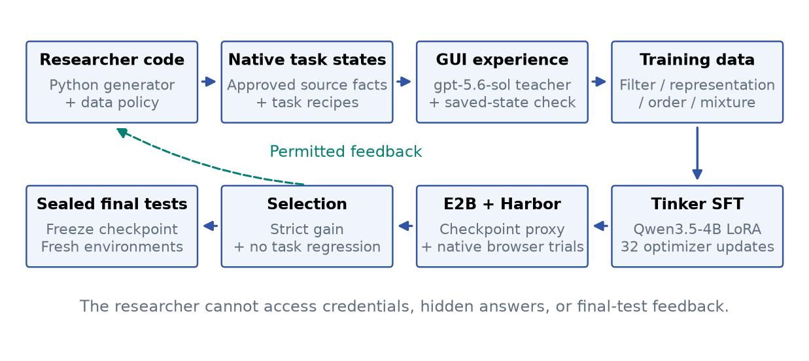
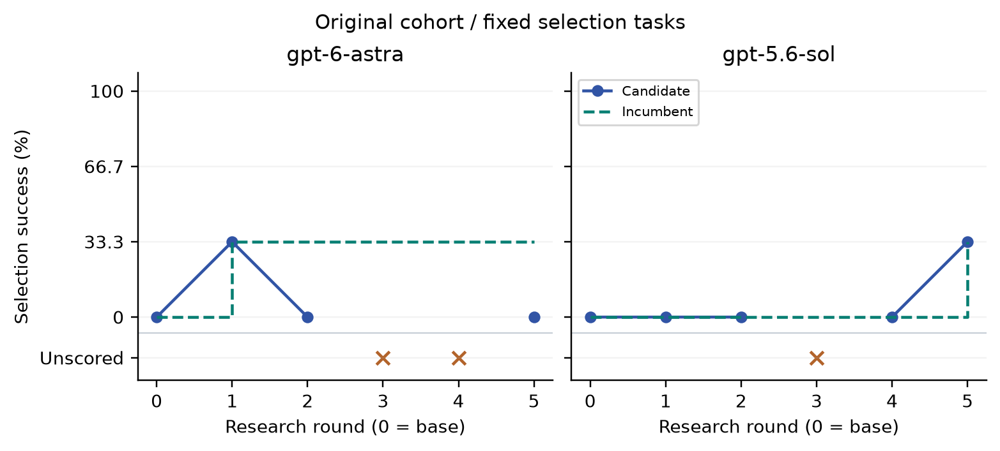
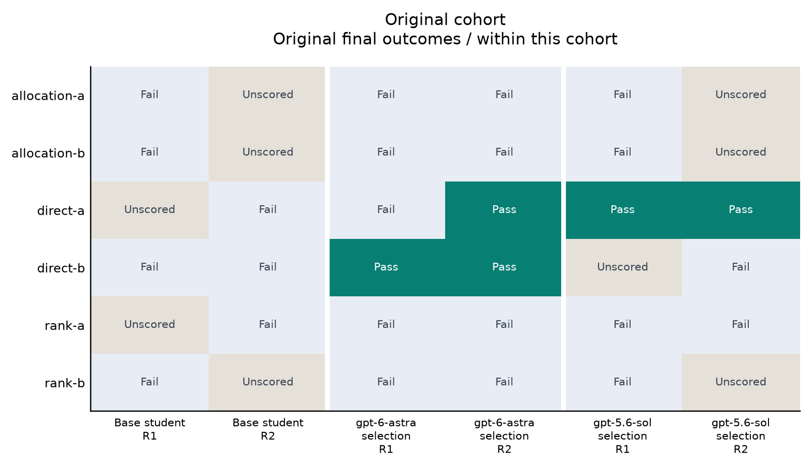
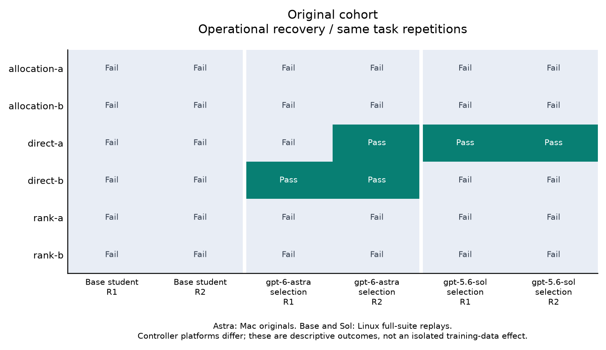
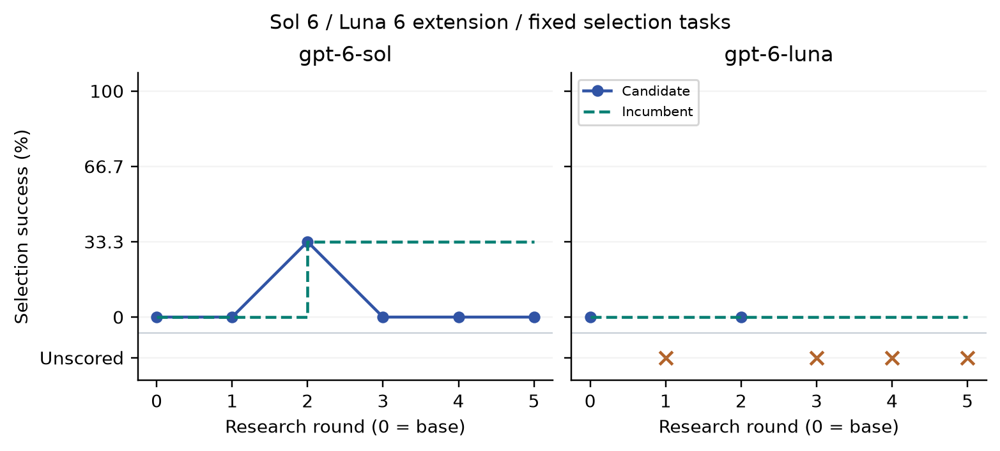
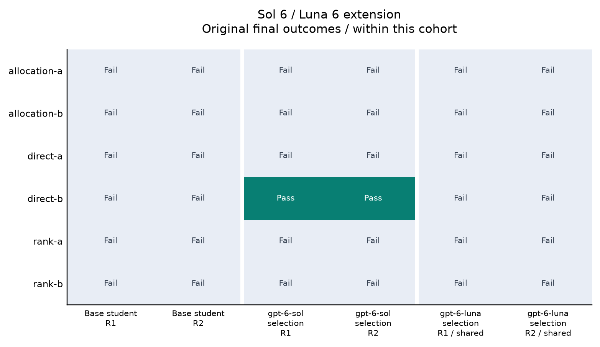

# CUA-RSIBench: Executable Data Research for Verifiable Computer Use

**Original cohort: gpt-6-astra and gpt-5.6-sol. Separate extension: gpt-6-sol and gpt-6-luna.**

[Code, evidence, and released artifacts: github.com/EnvLoop/cua-rsibench](https://github.com/EnvLoop/cua-rsibench)

## Abstract

Can a researcher agent turn browser-agent failures into better training data? We study this question in two separate cohorts of executable data research. Frontier researchers write Python factories, construct native Kanboard task states from public issue metadata, collect independently verified GUI demonstrations, and revise datasets using selection feedback. The fixed teacher is **gpt-5.6-sol**. Each valid candidate trains a fresh **Qwen/Qwen3.5-4B** LoRA adapter through Tinker; Harbor evaluates the student in E2B with an independent saved-state verifier. Original cohort (gpt-6-astra, gpt-5.6-sol) completes 10 research rounds, 7 training candidates, and 832,655 scheduled training tokens. Sol 6 / Luna 6 extension (gpt-6-sol, gpt-6-luna) completes 10 research rounds, 6 training candidates, and 804,299 scheduled training tokens. Selected students are evaluated on each cohort's own sealed final instances.

Original cohort: original final means are Base student Unscored; Student selected by gpt-6-astra 25.0%; Student selected by gpt-5.6-sol Unscored. Its infrastructure-invalid originals remain unscored; separately reported whole-suite recoveries preserve those originals and disclose controller-platform differences. Sol 6 / Luna 6 extension: original final means are Base student 0.0%; Student selected by gpt-6-sol 16.7%; Student selected by gpt-6-luna 0.0%. Scores, training resources, invalid submissions, and infrastructure failures are reported separately by cohort. This is a small data-research pilot, not evidence of sustained recursive self-improvement or broad computer-use generalization.

These are separate cohorts, not a matched four-model ranking. Selection tasks and base-selection evidence are shared, but final source records and task instances differ. The extension starts with explicit turn deadlines and baseline diagnostics from round 1. Compare each selected student with its own cohort final baseline; do not pool scores or final trials across cohorts.

## 1. Research question

A computer-use agent can issue valid clicks while reopening the wrong task, leave edits unsaved, miss a planning constraint, or stop after changing only one required record. Useful training experience must teach behavior that survives interaction with real software. A successfully generated dataset or completed training job alone does not establish an improvement in task completion.

We separate three roles. A frontier researcher changes the training-data policy; a fixed teacher produces permitted GUI experience; a separate student is trained and evaluated. Researcher model IDs identify the source of the data strategy, not the identity of the evaluated browser student. Direct frontier-actor calibration in the historical v0.4 release is a separate experiment.

---PAGEBREAK---

## 2. Protocol and cohort boundaries

RSIBench-Data fixes surrounding post-training services while measuring training-data research [1]. Its Appendix B describes an action space covering executable task states, trajectories, validation, filtering, representation, mixtures, and feedback-driven revision. Our historical v0.4 release selected examples from one trajectory. The present executable-factory studies add researcher-authored programs and new verified native episodes.

For researcher r and round t, a policy produces dataset D(r,t) from training sources and prior selection feedback. Every valid candidate starts from the same base student: M(r,t) = Train(M0, D(r,t); c). Training does not continue the preceding adapter. Researchers may generate task recipes, request teacher rollouts, choose decision-only or full-history records, deduplicate, repeat, order, and mix verified examples. They cannot invent observations or admit unexecuted successful trajectories.

Promotion requires a strict mean gain on three selection tasks with no per-task regression from the incumbent. Equal scores retain the earlier checkpoint, including the base. All searches within a cohort close before its final tests start. Final evidence is never returned as research feedback.

---PAGEBREAK---

### 2.1. Separate experimental cohorts

| Cohort / researcher models | Protocol and evidence boundary |
| --- | --- |
| Original cohort: gpt-6-astra, gpt-5.6-sol | The original cohort added an explicit remaining-turn deadline in round 5. Its early rounds did not expose the same round-1 baseline diagnostics as the extension. 6 final variants; 2 same-seed environment repetitions. The repaired base-student selection execution is the source evidence subsequently reused by the extension. |
| Sol 6 / Luna 6 extension: gpt-6-sol, gpt-6-luna | The extension starts fresh factory lineages with explicit remaining-turn deadlines and baseline diagnostics from round 1. 6 final variants; 2 same-seed environment repetitions. The selection baseline is explicitly reused from the original cohort; it is not a new execution or independent sample. |

**Table 1.** The two cohorts share a student, teacher, training settings, and selection tasks. Their final task records and researcher-facing feedback timing differ. No pooled outcome or matched four-way ranking is reported.

The extension inherits no researcher-authored programs, datasets, or trajectories from the original cohort. Its selection baseline is a verified copy of the same repaired base execution, explicitly identified as reused evidence. The extension's final cases use previously unused records from the allowed final source pool while preserving the direct/rank/allocation structure. Source isolation does not imply unseen-template generalization.

## 3. Application, source data, and tasks

The environment runs **Kanboard 1.2.54**, with its original PHP controllers, forms, comments, projects, and SQLite persistence [2]. Each actor episode starts in a fresh application instance. Setup API operations initialize the fixture before the actor begins and receive no agent credit. The measured interface is DOM-assisted browser use; screenshots are retained for audit and are not model inputs.

The snapshot contains 37 authentic public issue metadata records with URLs, issue numbers, capped titles, states, timestamps, labels, and comment counts. Twelve IDs each are assigned to training, selection, and final pools; one is unused. These pools do not overlap. Issue bodies, authors, and email addresses are excluded. Staff, workflow rules, planning values, costs, capacities, dependencies, project names, and archive distractors are synthetic.

| Cohort | Selection / final source IDs used | Training supervision IDs used |
| --- | --- | --- |
| Original cohort | 5 / 4 | 9 |
| Sol 6 / Luna 6 extension | 5 / 4 | 8 |

The table counts distinct records actually used within each cohort. Instances within a split reuse records. Final records differ across the two cohorts, while task templates and application structure remain shared.

---PAGEBREAK---

| Task family | Required behavior | Common valid failure |
| --- | --- | --- |
| Direct updates | Find specified records; change assignee, priority, and complexity; save | Edit another record or select the wrong value |
| Conditional ranking | Apply source predicates; sort with a tie-break; update each selected record | Stop after one target or confuse source state with local state |
| Constrained allocation | Maximize value under budget and dependency rules; minimize cost on value ties | Choose a feasible but suboptimal set |

Final variants change insertion order, target attributes, ranking direction, and planning alternatives. Allocation retains a blocked high-value distractor and equal-value alternatives involving a dependent pair versus a single task. These variations test robustness jointly; they do not isolate a single shortcut causally.

## 4. Verification and isolation

A trusted controller derives targets from validated recipes and source facts. A separate Harbor verifier compares initial and final database state. Strict success requires every intended update and preservation of unrelated records and business tables. Completion claims and screenshots do not earn reward. Narrow normalization covers application-maintained timestamps, null versus zero time fields, and native newline conversion. Missing records, wrong targets, changed comments, and extra edits fail.

---PAGEBREAK---

The research workspace is a separate E2B sandbox. A root-owned supervisor runs generated code as a non-root user in an empty network namespace with no-new-privileges and bounded CPU, memory, processes, file size, and time. Training inputs are read-only. Provider credentials, host files, service journals, final tasks, and hidden answers are excluded. A live probe checked these boundaries and sandbox cleanup.

Teacher and student receive visible page text, control references, memory, and the previous action outcome. Actions are click, fill, select, limited keypress, back, and finish. No shell, SQL, application API, file editor, or arbitrary URL action is available. Training and evaluation share the prompt constructor. Positive examples are reconstructed from actual trajectories and saved-state verification. Token preflight rejects oversized sequences, excessive targets, and schedules that would omit records.

## 5. Fixed services and evidence accounting

All researcher API requests use AgentRouterHub's Responses interface. Exact model IDs are requested provider identifiers, not independent attestations of hosted weights. The fixed teacher remains **gpt-5.6-sol**, including for the Sol 6 and Luna 6 researchers. The student is **Qwen/Qwen3.5-4B**. Tinker performs real LoRA updates and sampler checkpoint creation; an authenticated E2B proxy serves the checkpoint; Harbor runs native tasks with separate verification [3-5].

| Component | Declared setting |
| --- | --- |
| Research budget | At most 5 rounds and 1,048,576 scheduled training tokens per researcher |
| Per-round generation | 20 logical turns; up to 40 charged calls with retries; 12 program runs; 3 new rollouts; 100 teacher calls |
| Training | 32 updates; batch 2; rank 8; learning rate 0.0001; seed 23 |
| Data exposure | At most 64 records with full coverage; 16,384 tokens per sequence; 262,144 scheduled tokens per candidate |
| Student sampling | Temperature 0; seed 23; at most 512 output tokens |
| Evaluation | 90 actions per task; 1,500-second actor timeout; 3 tasks per execution chunk |
| Final evaluation | 6 variants per cohort, each evaluated twice in fresh environments at the same sampling seed |

**Table 2.** Shared declared settings. Scheduled tokens include masked input tokens and are not a dollar estimate. The study does not adopt the reference paper's monetary or whole-campaign wall-time budget.

---PAGEBREAK---

New training requires a reservation; uncertain paid failures remain charged conservatively. Historical imports in the original cohort are labeled in its audit and results. A rejected submission has no trained checkpoint and receives no task score. An infrastructure-invalid execution also remains unscored, with its original evidence retained. A recorded recovery must bind the same checkpoint and declared task/service settings; it is not a new data-research candidate.

The original launch exposed a serving defect: a 256-entry cache could not cover three 90-action trials. Capacity was derived as 270 and the base and initial candidates were rerun without changing their weights or task packages. Repaired executions and originals remain distinguishable. The extension starts on that repaired service path.

Final runners verify frozen selection, training and checkpoint identities, sealed task hashes, application/verifier files, runtime hashes, and execution timing. If two comparison roles select the same checkpoint within a cohort, they may explicitly share execution evidence. Such shared bindings do not add independent observations. Every final mean requires the complete prescribed set of valid results.

The remote-control-plane-v1 amendment moves trusted orchestration from the Mac host to a separate Linux E2B instance. Frozen actor, verifier, application packages, checkpoints, and sampling settings remain bound by hashes. The remote controller verifies 98 package versions and nine installed source files before inference; Python patch versions differ (3.12.13 on the host and 3.12.14 remotely). Downloaded evidence archives and every member are checked before admission. Original invalid runs remain available. Eligible original final slots use one whole-suite replay, preserving the same logical repetition; their recovery means contain only the six fresh outcomes.

Fresh environments still expose nuisance variation. In Luna 6 round two, the original direct task passed while its declared remote recovery failed. First prompt and response hashes matched on all three tasks. At step three, observed differences were CSRF query values and displayed creation/modification/move times; masking those fields made the observations identical. Action sequences later diverged. This documents a reproducibility limitation without attributing causality to either field or excluding inference variability. The controller does not remove these fields or change the actor during the study.

---PAGEBREAK---

## 6. Original cohort

Researcher models: **gpt-6-astra, gpt-5.6-sol**. Fixed teacher: **gpt-5.6-sol**. Trained student: **Qwen/Qwen3.5-4B**.

The original cohort added an explicit remaining-turn deadline in round 5. Its early rounds did not expose the same round-1 baseline diagnostics as the extension. The repaired base-student selection execution is the source evidence subsequently reused by the extension.

| Researcher model | Trained / rounds | First / best / last scored | Selected | Train tokens |
| --- | --- | --- | --- | --- |
| gpt-6-astra | 3 / 5 | 33.3% / 33.3% / 0.0% | round-1 | 371,887 |
| gpt-5.6-sol | 4 / 5 | 0.0% / 33.3% / 33.3% | round-5 | 460,768 |

**Table 3.** Selection and resource use within original cohort. Unscored research attempts are not zero-score student evaluations. Checkpoints follow the declared strict-gain/no-regression rule.

gpt-6-astra retains round-1 at 33.3% after 5 research rounds. 3 candidates completed training; 2 rounds have no scored candidate. Its scored candidate sequence is 33.3%, 0.0%, 0.0%.

1 round was imported historically, predating the pre-execution training reservation guard.

gpt-5.6-sol retains round-5 at 33.3% after 5 research rounds. 4 candidates completed training; 1 round has no scored candidate. Its scored candidate sequence is 0.0%, 0.0%, 0.0%, 33.3%.

gpt-5.6-sol has 1 recorded evaluation recovery; the audit retains the original execution separately.

1 round was imported historically, predating the pre-execution training reservation guard.

---PAGEBREAK---

### 6.1. Final evaluation within this cohort

| Comparison role | Mean by repetition | Original mean |
| --- | --- | --- |
| Base student | Unscored / Unscored | Unscored |
| Student selected by gpt-6-astra | 16.7% / 33.3% | 25.0% |
| Student selected by gpt-5.6-sol | Unscored / Unscored | Unscored |

**Table 4.** Complete means require all prescribed task results. Repetitions use the same sampling seed in fresh environments; shared checkpoint bindings do not create independent evidence.

Student selected by gpt-6-astra has no complete comparison with the base because at least one prescribed execution is infrastructure-invalid.

Student selected by gpt-5.6-sol has no complete comparison with the base because at least one prescribed execution is infrastructure-invalid.

Undefined complete means remain unscored; partial successful executions are not substituted for the prescribed mean.

Final outcomes are not fed back into research or used to choose a replacement checkpoint. The source records and task instances differ between cohorts; no cross-cohort final ranking is computed.

---PAGEBREAK---

### 6.2. Operational recovery, reported separately

| Comparison role | Mean by repetition | Displayed mean |
| --- | --- | --- |
| Base student | 0.0% / 0.0% | 0.0% |
| Student selected by gpt-6-astra | 16.7% / 33.3% | 25.0% |
| Student selected by gpt-5.6-sol | 16.7% / 16.7% | 16.7% |

**Table 4R.** Audited recovery view of the same final task/repetition assignments. Original invalid means remain undefined in Table 4. These are not additional independent repetitions.

Student selected by gpt-6-astra has an original final mean of 25.0%, 25.0 percentage points above its own cohort base mean of 0.0%. This is a descriptive comparison over the fixed task instances, not a population estimate.

These valid original executions are retained in this view without replay.

Student selected by gpt-5.6-sol has an operationally recovered final mean of 16.7%, 16.7 percentage points above its own cohort base mean of 0.0%. This is a descriptive comparison over the fixed task instances, not a population estimate.

Each eligible infrastructure-invalid slot is replayed once as a fresh six-task suite on the trusted Linux E2B controller. Frozen checkpoints, tasks, actor, verifier, and sampling are unchanged. Recovery scores use only fresh rows. Valid original slots are never replayed. These are the same prescribed repetitions, not new independent samples or research seeds. Original outcomes remain above.

Astra's retained originals use the Mac controller; base and Sol replays use Linux. This view is not platform-matched. Its differences cannot isolate training-data effects from controller or observation variation.

---PAGEBREAK---

## 7. Sol 6 / Luna 6 extension

Researcher models: **gpt-6-sol, gpt-6-luna**. Fixed teacher: **gpt-5.6-sol**. Trained student: **Qwen/Qwen3.5-4B**.

The extension starts fresh factory lineages with explicit remaining-turn deadlines and baseline diagnostics from round 1. The selection baseline is explicitly reused from the original cohort; it is not a new execution or independent sample.

| Researcher model | Trained / rounds | First / best / last scored | Selected | Train tokens |
| --- | --- | --- | --- | --- |
| gpt-6-sol | 5 / 5 | 0.0% / 33.3% / 0.0% | round-2 | 664,132 |
| gpt-6-luna | 1 / 5 | 0.0% / 0.0% / 0.0% | base | 140,167 |

**Table 5.** Selection and resource use within sol 6 / luna 6 extension. Unscored research attempts are not zero-score student evaluations. Checkpoints follow the declared strict-gain/no-regression rule.

gpt-6-sol retains round-2 at 33.3% after 5 research rounds. 5 candidates completed training; 0 rounds have no scored candidate. Its scored candidate sequence is 0.0%, 33.3%, 0.0%, 0.0%, 0.0%.

gpt-6-luna retains base at 0.0% after 5 research rounds. 1 candidate completed training; 4 rounds have no scored candidate. Its scored candidate sequence is 0.0%.

gpt-6-luna has 1 recorded evaluation recovery; the audit retains the original execution separately.

The reused selection baseline was orchestrated from the Mac. Recorded later candidate evaluations use the Linux remote controller. Promotion applies the declared score gate to those operationally versioned results; selection deltas do not isolate a training-data effect from controller or observation variation. The extension final comparison evaluates both its base and selected checkpoint through the same Linux controller setup.

---PAGEBREAK---

### 7.1. Final evaluation within this cohort

| Comparison role | Mean by repetition | Original mean |
| --- | --- | --- |
| Base student | 0.0% / 0.0% | 0.0% |
| Student selected by gpt-6-sol | 16.7% / 16.7% | 16.7% |
| Student selected by gpt-6-luna | 0.0% / 0.0% | 0.0% |

**Table 6.** Complete means require all prescribed task results. Repetitions use the same sampling seed in fresh environments; shared checkpoint bindings do not create independent evidence.

Student selected by gpt-6-sol has an original final mean of 16.7%, 16.7 percentage points above its own cohort base mean of 0.0%. This is a descriptive comparison over the fixed task instances, not a population estimate.

Student selected by gpt-6-luna is the base checkpoint and references the same base executions; it adds no independent samples.

Final outcomes are not fed back into research or used to choose a replacement checkpoint. The source records and task instances differ between cohorts; no cross-cohort final ranking is computed.

---PAGEBREAK---

## 8. Interpretation and limitations

The studies demonstrate executable agent-authored research programs, new native task states, verified GUI experience, real weight updates, fixed evaluation, and preserved checkpoint selection. They do not establish sustained recursive self-improvement: a frontier researcher produces data for a separate smaller student, and improved students do not become the next researchers.

These are separate cohorts, not a matched four-model ranking. Selection tasks and base-selection evidence are shared, but final source records and task instances differ. The extension starts with explicit turn deadlines and baseline diagnostics from round 1. Compare each selected student with its own cohort final baseline; do not pool scores or final trials across cohorts.

Each cohort is small: one application, three task families, one research seed per system, three selection instances, and six final variants. Instances share records, templates, UI structure, and workflow conventions. Public metadata may occur in pretraining data. Two same-seed environment repetitions test execution stability, not independent draws from a broad task distribution. They cannot support general confidence intervals or a frontier-model ranking.

A larger final suite, multiple research seeds, and an equal-budget non-adaptive control are needed to attribute gains to feedback-driven research. The controller's no-regression promotion rule is narrower than unrestricted researcher checkpoint selection. Successful teacher demonstrations and larger datasets do not themselves establish student gains. Related direct-actor calibration in v0.4 establishes limited native-workflow solvability, not student calibration on every new instance.

The researcher interface also affects outcomes. In Luna 6's fifth round, 11 replies contained an English prose preamble followed by a syntactically valid, allowed JSON action. These violated the fixed requirement to return exactly JSON. Clean fenced JSON is accepted by the parser; prose is not stripped. All 20 provider receipts reported completion, and the rejected replies used 112-191 output tokens, so this was not output-token exhaustion. The round ended without submission and received no training or task score. Raw provider envelopes are unavailable, leaving the contribution of response-message aggregation unknown. This measures compliance with the specified interface, not task reasoning in isolation.

No unseen-application, pixel-only grounding, original Microsoft Office, Windows, macOS, or cross-application enterprise capability is measured. Task difficulty needs calibrated tiers and independent solvability evidence in larger studies.

## 9. Reproducibility and release boundary

The release includes the implementation, separate sanitized cohort evidence, a combined presentation index, manuscript, standalone figures, and a portable explorer. Audits reconstruct trusted training records, verify data and checkpoint bindings, re-read independent evaluator outcomes, check resources and promotion, and bind final executions to frozen plans. Raw credentials, private checkpoint identifiers, provider envelopes, and host paths are excluded.

The historical v0.4 selection-only pilot stays separate. Its scores and recovery runs are not pooled with these executable-factory cohorts. Provider dollar totals are unknown. A functioning training or execution service is not counted as successful agent work.

---PAGEBREAK---

## Appendix A. A sealed allocation instance

The extension's `model6-final-allocation-a` places the following records in the native application. Issue IDs and source metadata come from the public Kanboard snapshot. Every numeric planning field and dependency below is synthetic and is visibly labeled as such in the task descriptions.

| Public issue reference | Cost | Hours | Value | Dependency | Blocked |
| --- | --- | --- | --- | --- | --- |
| GH-5827 | 3 | 2 | 8 | None | No |
| GH-5835 | 5 | 2 | 9 | GH-5827 | No |
| GH-5837 | 9 | 4 | 17 | None | No |
| GH-5815 | 3 | 1 | 30 | None | Yes |

**Table A1.** One actual sealed final fixture, published after research selection was frozen. Planning values are not claims about the underlying public issues.

The RUNBOOK caps total cost at 9 and hours at 4. The agent must exclude blocked records, honor dependencies, maximize value, and then minimize cost. The pair GH-5827 + GH-5835 has value 17, cost 8, and 4 hours. GH-5837 also has value 17 but costs 9, so choosing that feasible single task fails the tie-break. The high-value GH-5815 distractor is blocked and cannot be selected.

The correct browser workflow assigns Singh, priority 1, and complexity 3 to both records in the pair, saves the edits, and preserves every other record, description, comment, RUNBOOK entry, and archive item. The trusted compiler derives those targets; the separate verifier independently checks the saved database against them. Editing only one target, choosing the feasible but more expensive alternative, or modifying unrelated state receives zero strict reward.

This small instance tests a specific conjunction of navigation, reading, planning, multi-record editing, and preservation. It does not represent the scale or ambiguity of a production enterprise backlog. Larger worlds and longer cross-application dependencies remain future profiles.

---PAGEBREAK---

## Appendix B. What the data policies produced

The following rows describe each retained trained candidate and the last trained candidate of its research lineage. Luna 6 retained the base, so its only trained candidate is shown for context. Distinct records count unique message sequences; repeated copies still consume exposure and scheduled training tokens. Episode counts are reconstructed from independently verified trajectory provenance.

| Factory / round | Records / distinct | Episodes | Decision / history | Selection outcome |
| --- | --- | --- | --- | --- |
| gpt-6-astra / 1 | 26 / 26 | 2 | 26 / 0 | Retained |
| gpt-6-astra / 5 | 61 / 61 | 3 | 61 / 0 | Not retained |
| gpt-5.6-sol / 5 | 25 / 25 | 2 | 25 / 0 | Retained |
| gpt-6-sol / 2 | 33 / 33 | 2 | 32 / 1 | Retained |
| gpt-6-sol / 5 | 64 / 50 | 3 | 63 / 1 | Not retained |
| gpt-6-luna / 2 | 49 / 49 | 2 | 49 / 0 | Base retained |

**Table B1.** Measured dataset composition. The two cohorts remain separate experimental groups. These examples describe policy outputs and selection outcomes; they are not a controlled comparison of representation choices.

The selected Sol 6 dataset contains 32 decision records and one history record from two verified episodes. Its final research candidate expands to 64 records from three episodes, but only 50 message sequences are distinct. That larger mixture scores 0/3 on selection and does not replace the earlier 1/3 checkpoint. Astra likewise retains its initial 26-record dataset over a later 61-record candidate. More data and more successful teacher experience did not automatically yield a better selected student under this fixed training schedule.

The release includes recorded Python factory programs and their hashes, including unsuccessful rounds. The trusted controller validates provenance and resource limits; it does not rewrite a researcher's submitted data to make it pass. Interface failures, rejected submissions, valid but unsuccessful students, and infrastructure-invalid executions remain separate outcomes.

## References

[1] Meng et al. RSIBench-Data: Benchmarking Data-Centric Research for Recursive Self-Improvement. 2026. [Paper](https://arxiv.org/abs/2607.25886), [code](https://github.com/evolvent-ai/RSIBench-Data).

[2] Kanboard. [Original application and source](https://github.com/kanboard/kanboard).

[3] Thinking Machines Lab. [Tinker](https://github.com/thinking-machines-lab/tinker).

[4] E2B. [Sandbox infrastructure](https://github.com/e2b-dev/E2B).

[5] Harbor. [Evaluation framework](https://github.com/laude-institute/harbor).
